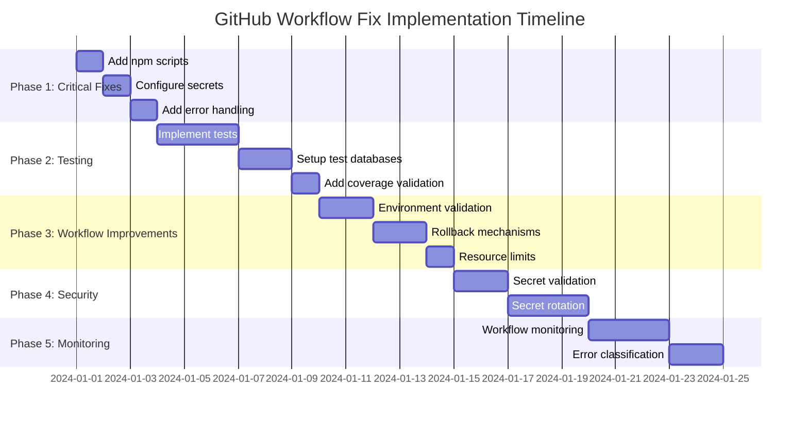

# GitHub Workflow Comprehensive Fix Plan

## Executive Summary

This document outlines a systematic approach to fixing all identified GitHub workflow issues in the sugar-daddy-platform project. The plan addresses critical failures, missing infrastructure, security vulnerabilities, and monitoring gaps.

## Current State Analysis

### Workflow Files Analyzed
- `.github/workflows/ci-cd.yml` (Main CI/CD Pipeline)
- `.github/workflows/ci.yml` (Basic CI)
- `.github/workflows/deploy.yml` (GitHub Pages Deployment)
- `.github/workflows/monitoring.yml` (Monitoring & Alerting)
- `.github/workflows/security-scanning.yml` (Security Pipeline)
- `.github/workflows/test.yml` (Test Suite)

### Critical Issues Identified

1. **Missing Secrets (8 total)**:
   - `SNYK_TOKEN` (Snyk security scanning)
   - `AWS_ACCESS_KEY_ID` / `AWS_SECRET_ACCESS_KEY` (AWS deployments)
   - `K6_CLOUD_PROJECT_ID` / `K6_CLOUD_TOKEN` (Load testing)
   - `GITLEAKS_LICENSE` (Secret scanning)
   - `SLACK_WEBHOOK_URL` (Notifications)
   - `CODECOV_TOKEN` (Code coverage reporting)

2. **Missing Test Infrastructure**:
   - No actual test implementations
   - Only placeholder npm scripts
   - No test database setup
   - No coverage validation

3. **Architectural Problems**:
   - Circular workflow dependencies
   - No environment isolation
   - No error handling
   - No resource limits

## Comprehensive Fix Plan

### Phase 1: Critical Fixes (Immediate - 1-3 days)

#### 1.1 Add Missing npm Scripts
**Files to modify**: All backend `package.json` files

```json
"scripts": {
  "type-check": "tsc --noEmit",
  "test": "jest --coverage --detectOpenHandles",
  "lint": "eslint . --ext .ts,.js",
  "test:ci": "npm run lint && npm run type-check && npm test"
}
```

#### 1.2 Configure GitHub Secrets
**Action**: Add all required secrets to GitHub repository

**Secrets Configuration Guide**:
```bash
# Go to: https://github.com/owner/repo/settings/secrets/actions
# Add these secrets:
SNYK_TOKEN=your_snyk_api_token
AWS_ACCESS_KEY_ID=your_aws_access_key
AWS_SECRET_ACCESS_KEY=your_aws_secret_key
K6_CLOUD_PROJECT_ID=your_k6_project_id
K6_CLOUD_TOKEN=your_k6_api_token
GITLEAKS_LICENSE=your_gitleaks_license
SLACK_WEBHOOK_URL=your_slack_webhook
CODECOV_TOKEN=your_codecov_token
```

#### 1.3 Add Basic Error Handling
**Files to modify**: All workflow files

```yaml
# Add to each job
steps:
  - name: Validate environment
    run: |
      #!/bin/bash
      set -e
      
      # Check for required secrets
      if [[ -z "${{ secrets.AWS_ACCESS_KEY_ID }}" && "${{ github.ref }}" == "refs/heads/main" ]]; then
        echo "ERROR: AWS secrets missing for production deployment"
        exit 1
      fi
      
      # Check for required services
      if ! command -v docker &> /dev/null; then
        echo "ERROR: Docker not available"
        exit 1
      fi
```

### Phase 2: Testing Infrastructure (High Priority - 3-5 days)

#### 2.1 Implement Test Suites
**Files to create**: Test files for each service

**Test Structure**:
```
backend/
  {service}/
    __tests__/
      unit/
        service.test.ts
        models.test.ts
        routes.test.ts
      integration/
        api.test.ts
        database.test.ts
    jest.config.js
```

#### 2.2 Set Up Test Databases
**Approach**: Use Docker containers for isolated testing

```yaml
# In workflow files
services:
  postgres:
    image: postgres:15
    env:
      POSTGRES_PASSWORD: test_password
      POSTGRES_DB: test_db
    ports:
      - 5432:5432
  redis:
    image: redis:7
    ports:
      - 6379:6379
```

#### 2.3 Add Coverage Validation
**Configuration**: Update `jest.config.js` files

```javascript
module.exports = {
  coverageThreshold: {
    global: {
      branches: 80,
      functions: 80,
      lines: 80,
      statements: 80
    }
  },
  coverageReporters: ['text', 'lcov', 'clover']
}
```

### Phase 3: Workflow Improvements (Medium Priority - 5-7 days)

#### 3.1 Add Environment Validation
**Implementation**: Pre-deployment checks

```yaml
jobs:
  validate-environment:
    runs-on: ubuntu-latest
    steps:
      - name: Check AWS credentials
        if: github.ref == 'refs/heads/main'
        run: |
          aws sts get-caller-identity || exit 1
          
      - name: Check Kubernetes cluster
        run: |
          kubectl cluster-info || exit 1
```

#### 3.2 Implement Proper Rollback
**Enhancement**: Add rollback testing

```yaml
- name: Test rollback procedure
  run: |
    # Deploy known good version
    kubectl apply -f deployment/previous/
    
    # Verify rollback works
    kubectl rollout status deployment/api-gateway -n sugar-daddy --timeout=60s
    
    # Run smoke tests
    npm run test:smoke
```

#### 3.3 Add Resource Limits
**Configuration**: Workflow-level limits

```yaml
env:
  MAX_CONCURRENT_JOBS: 4
  API_RATE_LIMIT: 1000
  
jobs:
  security-scan:
    timeout-minutes: 30
    concurrency:
      group: security-${{ github.ref }}
      cancel-in-progress: true
```

### Phase 4: Security Enhancements (Medium Priority - 7-10 days)

#### 4.1 Add Secret Validation
**Implementation**: Pre-job secret checks

```yaml
- name: Validate secrets
  run: |
    #!/bin/bash
    MISSING_SECRETS=0
    
    # Check critical secrets
    if [[ -z "${{ secrets.AWS_ACCESS_KEY_ID }}" ]]; then
      echo "Missing: AWS_ACCESS_KEY_ID"
      MISSING_SECRETS=$((MISSING_SECRETS + 1))
    fi
    
    if [[ MISSING_SECRETS -gt 0 ]]; then
      echo "ERROR: $MISSING_SECRETS secrets missing"
      exit 1
    fi
```

#### 4.2 Implement Secret Rotation
**Approach**: Automated secret rotation workflow

```yaml
name: Secret Rotation

on:
  schedule:
    - cron: '0 0 1 * *' # Monthly rotation
  workflow_dispatch:

jobs:
  rotate-secrets:
    runs-on: ubuntu-latest
    steps:
      - name: Rotate AWS credentials
        run: |
          # Implement AWS credential rotation
          # Store new credentials in secrets
          
      - name: Notify security team
        uses: 8398a7/action-slack@v3
        with:
          status: custom
          fields: repo,message
          text: "Secrets rotated successfully"
```

### Phase 5: Monitoring and Maintenance (Long-term - 10-14 days)

#### 5.1 Implement Workflow Monitoring
**Solution**: Comprehensive monitoring system

```yaml
name: Workflow Monitoring

on:
  schedule:
    - cron: '*/15 * * * *' # Every 15 minutes
  workflow_run:
    workflows: ['*']
    types: [completed]

jobs:
  monitor-workflows:
    runs-on: ubuntu-latest
    steps:
      - name: Check recent workflow runs
        run: |
          #!/bin/bash
          FAILED_RUNS=$(gh api repos/{owner}/{repo}/actions/runs --jq '.workflow_runs | map(select(.conclusion == "failure")) | length')
          
          if [[ $FAILED_RUNS -gt 3 ]]; then
            echo "ALERT: Multiple workflow failures detected"
            # Trigger notification
          fi
```

#### 5.2 Add Error Classification
**Implementation**: Structured error handling

```yaml
- name: Classify and handle errors
  if: failure()
  run: |
    #!/bin/bash
    ERROR_TYPE="unknown"
    
    # Determine error type
    if [[ "${{ job.status }}" == "failure" && -n "${{ steps.deploy.outcome }}" ]]; then
      ERROR_TYPE="deployment"
    elif [[ -n "${{ steps.test.outcome }}" ]]; then
      ERROR_TYPE="test"
    fi
    
    # Handle different error types
    case $ERROR_TYPE in
      "deployment")
        # Rollback and notify
        ;;
      "test")
        # Run diagnostics
        ;;
      *)
        # General error handling
        ;;
    esac
```

## Implementation Timeline



## Risk Assessment

### High Risk Items
- **AWS Deployment Failures**: Could disrupt production services
- **Secret Exposure**: Improper secret handling could cause security breaches
- **Test Data Leakage**: Improper test isolation could corrupt production data

### Mitigation Strategies
- **Staged Rollouts**: Deploy to staging first, validate, then production
- **Secret Scanning**: Use GitLeaks and TruffleHog to prevent secret leaks
- **Database Isolation**: Use separate database instances for testing

## Success Metrics

### Key Performance Indicators
- **Workflow Success Rate**: Target 95%+ success rate
- **Test Coverage**: Minimum 80% coverage across all services
- **Deployment Time**: Reduce from ~30 minutes to <15 minutes
- **MTTR (Mean Time To Recovery)**: Improve from manual to <30 minutes automated

### Monitoring Dashboard
```
# Workflow Health Metrics
- Total workflow runs: [count]
- Success rate: [percentage]%
- Failure rate: [percentage]%
- Average duration: [minutes]m
- Longest running: [workflow_name] ([duration]m)

# Test Quality Metrics
- Overall coverage: [percentage]%
- Backend coverage: [percentage]%
- Frontend coverage: [percentage]%
- Integration test success: [percentage]%

# Security Metrics
- Vulnerabilities found: [count]
- Critical vulnerabilities: [count]
- Secrets detected: [count]
- Compliance status: [status]
```

## Maintenance Plan

### Regular Maintenance Tasks
1. **Weekly**: Review workflow logs for errors
2. **Monthly**: Update dependencies and security scans
3. **Quarterly**: Review and rotate secrets
4. **Annually**: Comprehensive workflow audit

### Continuous Improvement
- **Feedback Loop**: Collect developer feedback on workflow performance
- **Performance Optimization**: Regularly optimize slow workflows
- **Security Updates**: Stay current with GitHub Actions security best practices

## Documentation Requirements

### Required Documentation
1. **Secret Management Guide**: How to add/rotate secrets
2. **Workflow Troubleshooting Guide**: Common issues and solutions
3. **Test Writing Guide**: Standards for writing tests
4. **Deployment Checklist**: Pre-deployment validation steps
5. **Incident Response Plan**: What to do when workflows fail

## Approval and Implementation

### Implementation Checklist
- [ ] Review and approve this comprehensive plan
- [ ] Set up required GitHub secrets
- [ ] Implement Phase 1 critical fixes
- [ ] Validate Phase 1 fixes with test runs
- [ ] Proceed with subsequent phases as approved

### Next Steps
1. **Review this plan** with the development team
2. **Prioritize phases** based on business needs
3. **Assign resources** for implementation
4. **Schedule implementation** timeline
5. **Monitor progress** and adjust as needed

## Conclusion

This comprehensive plan addresses all identified GitHub workflow issues systematically. By following this structured approach, we can transform the current fragile workflow system into a robust, reliable, and maintainable CI/CD pipeline that supports the project's growth and stability requirements.