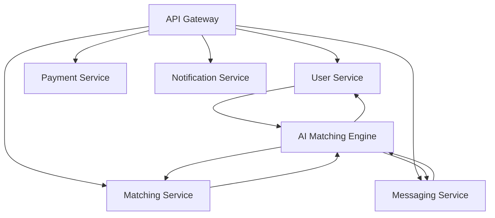
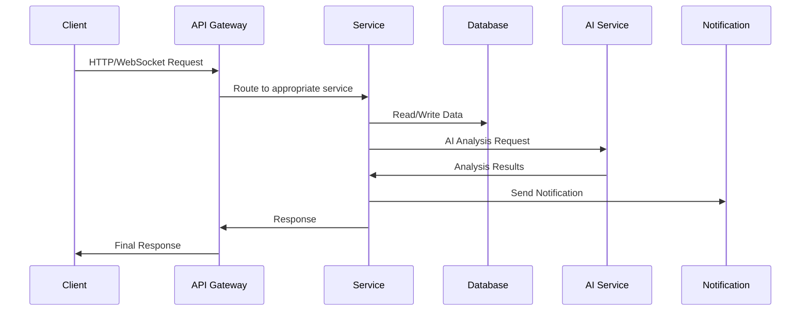
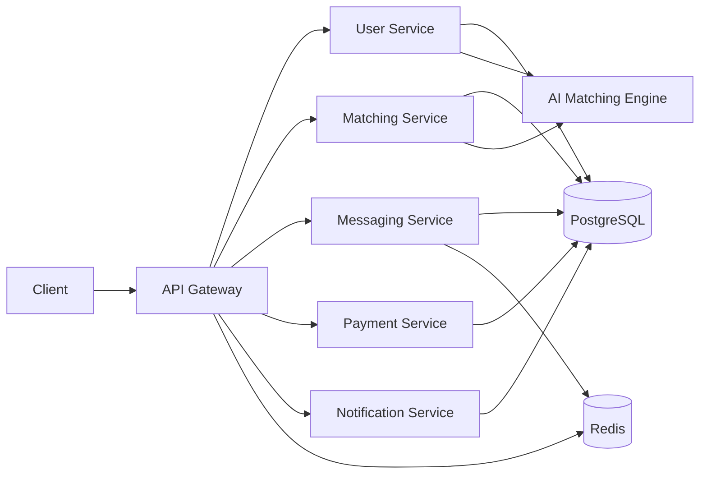

# Sugar Daddy Platform - Backend Analysis

## Overview

The Sugar Daddy Platform backend consists of 8 microservices organized into two main categories: core services and AI/ML services. The architecture follows a microservices pattern with an API Gateway as the entry point.

## Service Architecture

## Core Services

### 1. API Gateway (Port: 3001)
- **Technology**: Express, Axios, Socket.IO, Redis
- **Role**: Entry point for all API requests, routes to appropriate services
- **Key Features**:
  - Request routing and load balancing
  - Authentication middleware
  - Health monitoring for all services
  - Real-time WebSocket connections
- **Dependencies**: All other services

### 2. User Service (Port: 3002)
- **Technology**: Express, Sequelize, PostgreSQL, JWT, bcrypt
- **Role**: User management, authentication, and profiles
- **Key Features**:
  - User registration and authentication
  - Profile management
  - Verification system (photo, income, background checks)
  - Premium features (Super Likes, Incognito Mode, Profile Boost)
  - Personality questionnaires and analysis
- **Dependencies**: AI Matching Engine, Notification Service

### 3. Matching Service (Port: 3003)
- **Technology**: Express, Axios, PostgreSQL
- **Role**: User matching and search functionality
- **Key Features**:
  - Advanced search with AI ranking
  - Compatibility calculations
  - Mutual matching logic
  - Location-based search
  - Discovery feed generation
- **Dependencies**: User Service, AI Matching Engine, Notification Service, Messaging Service

### 4. Messaging Service (Port: 3004)
- **Technology**: Express, Socket.IO, Redis, PostgreSQL
- **Role**: Real-time communication between users
- **Key Features**:
  - Real-time chat with WebSockets
  - Video calling capabilities
  - Message templates
  - Read receipts and typing indicators
  - Conversation management
- **Dependencies**: User Service, Notification Service

### 5. Payment Service (Port: 3005)
- **Technology**: Express, Stripe, PayPal, Axios, PostgreSQL
- **Role**: Payment processing and subscription management
- **Key Features**:
  - Payment intent creation
  - Subscription management
  - Virtual gift sending
  - Transaction history
  - Webhook handling for payment events
- **Dependencies**: User Service, Notification Service

### 6. Notification Service (Port: 3006)
- **Technology**: Express, Nodemailer, Firebase Admin, Axios, PostgreSQL
- **Role**: User notifications and email communications
- **Key Features**:
  - Push notifications (iOS and Android)
  - Email notifications
  - Welcome emails
  - Match notifications
  - Subscription reminders
- **Dependencies**: User Service

## AI/ML Services

### 7. AI Matching Engine (Port: 4001)
- **Technology**: Express, Axios
- **Role**: AI-powered matching and analysis
- **Key Features**:
  - Personality analysis (Big Five traits)
  - Compatibility scoring
  - Face recognition for verification
  - Fraud detection
  - Content moderation
  - Smart match suggestions
- **Dependencies**: User Service, Matching Service

### 8. Content Moderation Service (Port: 4002)
- **Technology**: Express
- **Role**: Content moderation and filtering
- **Status**: Basic implementation (placeholder)

### 9. Fraud Detection Service (Port: 4003)
- **Technology**: Express
- **Role**: Fraud detection and risk assessment
- **Status**: Basic implementation (placeholder)

## Infrastructure Components

### Database
- **PostgreSQL**: Primary database for all services
- **Redis**: Caching and real-time messaging support

### Containerization
- **Docker**: All services are containerized
- **Docker Compose**: Orchestration for development environment

## Data Flow

## Key Dependencies

### Common Dependencies
- Express: Web framework
- Sequelize: ORM for PostgreSQL
- Axios: HTTP client for inter-service communication
- JWT: Authentication tokens
- Dotenv: Environment variable management

### Service-Specific Dependencies
- **API Gateway**: Socket.IO, Redis
- **User Service**: bcrypt, multer, speakeasy, qrcode
- **Messaging Service**: Socket.IO, Redis
- **Payment Service**: Stripe, PayPal
- **Notification Service**: Nodemailer, Firebase Admin
- **AI Matching Engine**: Advanced AI/ML libraries (mock implementations)

## Configuration Issues and Gaps

### 1. Missing AI Service Configuration
- **Issue**: Services reference `AI_SERVICE_URL` but it's not defined in docker-compose.yml
- **Impact**: AI-powered features won't work without proper configuration
- **Solution**: Add AI Matching Engine to docker-compose.yml with proper service name

### 2. Environment Variable Issues
- **Issue**: Some services use hardcoded JWT secrets and placeholder values
- **Impact**: Security vulnerabilities and non-functional payment systems
- **Solution**: Use proper environment variable management with .env files

### 3. Database Schema Conflicts
- **Issue**: All services use the same PostgreSQL database without schema separation
- **Impact**: Potential schema conflicts and data isolation issues
- **Solution**: Implement separate schemas or databases for each service

### 4. Incomplete AI Services
- **Issue**: Content Moderation and Fraud Detection services are placeholders
- **Impact**: Limited functionality for content safety and fraud prevention
- **Solution**: Implement full functionality or integrate with third-party services

### 5. Missing Service URLs in API Gateway
- **Issue**: Service URLs are hardcoded in API Gateway instead of using environment variables
- **Impact**: Inflexible configuration and deployment challenges
- **Solution**: Use environment variables for service URLs

## Recommendations

### 1. Infrastructure Improvements
- Add AI Matching Engine to docker-compose.yml
- Implement proper environment variable management
- Set up separate database schemas for each service
- Add health monitoring and circuit breaking

### 2. Security Enhancements
- Implement proper JWT secret management
- Add request validation and sanitization
- Implement rate limiting and DDoS protection
- Set up proper authentication for inter-service communication

### 3. Operational Improvements
- Implement centralized logging
- Add error tracking and monitoring
- Set up proper CI/CD pipelines
- Implement database migration system

### 4. AI Service Enhancements
- Complete Content Moderation service implementation
- Complete Fraud Detection service implementation
- Add proper AI/ML model integration
- Implement model versioning and A/B testing

## Service Communication Patterns

### Synchronous Communication
- REST API calls between services using Axios
- Request/response pattern for most operations

### Asynchronous Communication
- WebSocket connections for real-time messaging
- Event-based notifications for user actions

### Data Consistency
- Services maintain their own data stores
- Eventual consistency model for distributed data
- Transactions handled at the service level

## Deployment Architecture

## Conclusion

The Sugar Daddy Platform backend is well-structured with clear separation of concerns. However, several configuration issues need to be addressed, particularly around the AI services and environment variable management. The architecture provides a solid foundation for a scalable dating platform with comprehensive features for both sugar daddies and sugar babies.