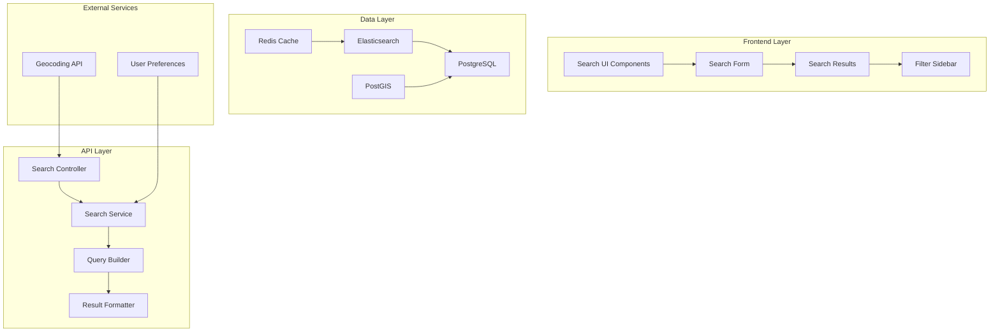
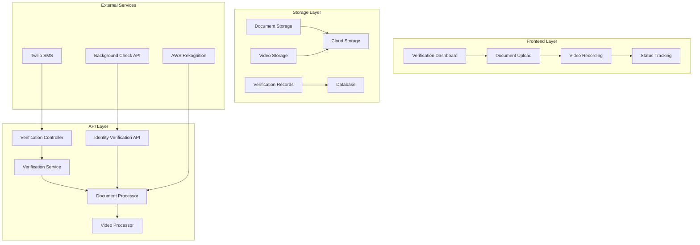
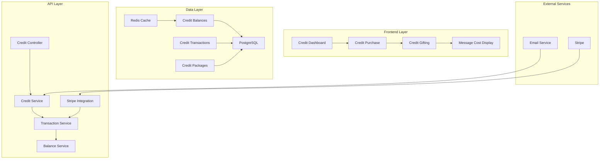
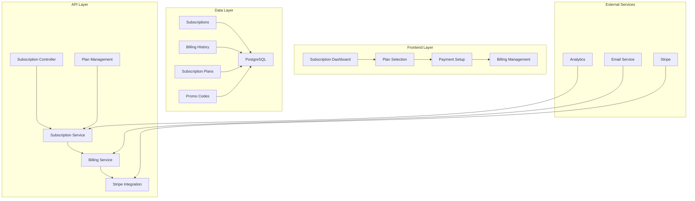

# Technical Specifications for Seeking.com Feature Parity

## Overview

This document provides detailed technical specifications for implementing the highest priority missing features identified in the Seeking.com gap analysis. These specifications cover the P1 critical features that should be implemented first to establish a solid foundation for BrandyBabe.com.

## 1. Advanced Search and Filtering System

### 1.1 Architecture Overview



### 1.2 Database Schema Extensions

```sql
-- Enhanced user preferences table
CREATE TABLE user_preferences (
    user_id UUID REFERENCES users(id) PRIMARY KEY,
    looking_for VARCHAR(20) CHECK (looking_for IN ('sugar_daddy', 'sugar_baby', 'both')),
    age_min INTEGER CHECK (age_min >= 18 AND age_min <= 100),
    age_max INTEGER CHECK (age_max >= 18 AND age_max <= 100),
    income_min DECIMAL(10,2),
    income_max DECIMAL(10,2),
    lifestyle_preferences TEXT[], -- Array of lifestyle preferences
    education_level VARCHAR(50) CHECK (education_level IN ('high_school', 'some_college', 'bachelor', 'master', 'phd', 'other')),
    relationship_type VARCHAR(50) CHECK (relationship_type IN ('casual', 'long_term', 'friendship', 'mentorship', 'networking')),
    availability_days TEXT[], -- Array of days ['monday', 'tuesday', etc.]
    availability_time_start TIME,
    availability_time_end TIME,
    distance_preference INTEGER DEFAULT 50, -- miles
    verified_only BOOLEAN DEFAULT false,
    created_at TIMESTAMP DEFAULT NOW(),
    updated_at TIMESTAMP DEFAULT NOW()
);

-- User lifestyle preferences lookup table
CREATE TABLE lifestyle_preferences (
    id SERIAL PRIMARY KEY,
    name VARCHAR(50) UNIQUE NOT NULL,
    category VARCHAR(30) NOT NULL, -- 'hobbies', 'lifestyle', 'values', etc.
    description TEXT
);

-- Search history table
CREATE TABLE search_history (
    id SERIAL PRIMARY KEY,
    user_id UUID REFERENCES users(id),
    search_params JSONB NOT NULL,
    result_count INTEGER,
    search_duration_ms INTEGER,
    created_at TIMESTAMP DEFAULT NOW()
);

-- Saved searches table
CREATE TABLE saved_searches (
    id SERIAL PRIMARY KEY,
    user_id UUID REFERENCES users(id),
    name VARCHAR(100) NOT NULL,
    search_params JSONB NOT NULL,
    is_active BOOLEAN DEFAULT true,
    created_at TIMESTAMP DEFAULT NOW(),
    updated_at TIMESTAMP DEFAULT NOW()
);

-- User activity tracking for behavioral analysis
CREATE TABLE user_activity (
    id SERIAL PRIMARY KEY,
    user_id UUID REFERENCES users(id),
    activity_type VARCHAR(50) NOT NULL, -- 'search', 'view_profile', 'message', etc.
    activity_data JSONB,
    ip_address INET,
    user_agent TEXT,
    created_at TIMESTAMP DEFAULT NOW()
);
```

### 1.3 API Endpoints Specification

```typescript
// Advanced search endpoint
interface AdvancedSearchRequest {
  location?: {
    lat: number;
    lng: number;
    radius: number; // miles, default 50
  };
  ageRange?: [number, number];
  incomeRange?: {
    min: number;
    max: number;
  };
  lifestylePreferences?: string[];
  educationLevel?: string[];
  relationshipType?: string[];
  availability?: {
    days: string[];
    timeRange: [string, string]; // ["09:00", "17:00"]
  };
  verifiedOnly?: boolean;
  sortBy?: 'compatibility' | 'newest' | 'distance' | 'last_active';
  sortOrder?: 'asc' | 'desc';
  page?: number;
  limit?: number;
  includeBlocked?: boolean;
}

interface AdvancedSearchResponse {
  results: UserProfile[];
  pagination: {
    page: number;
    limit: number;
    total: number;
    totalPages: number;
  };
  facets: {
    ageGroups: { range: string; count: number }[];
    incomeLevels: { range: string; count: number }[];
    educationLevels: { level: string; count: number }[];
    lifestylePreferences: { preference: string; count: number }[];
  };
  searchTime: number; // milliseconds
}

// Search suggestions endpoint
interface SearchSuggestionsRequest {
  query: string;
  type: 'location' | 'lifestyle' | 'education';
  limit?: number;
}

interface SearchSuggestionsResponse {
  suggestions: string[];
  query: string;
}
```

### 1.4 Implementation Details

```typescript
// Search Service Implementation
class AdvancedSearchService {
  private elasticsearch: Client;
  private redis: Redis;
  private db: Sequelize;

  async searchUsers(
    userId: string, 
    params: AdvancedSearchRequest
  ): Promise<AdvancedSearchResponse> {
    // 1. Build Elasticsearch query
    const esQuery = this.buildElasticsearchQuery(params);
    
    // 2. Check cache first
    const cacheKey = this.generateCacheKey(params);
    const cached = await this.redis.get(cacheKey);
    if (cached) {
      return JSON.parse(cached);
    }

    // 3. Execute search
    const startTime = Date.now();
    const result = await this.elasticsearch.search({
      index: 'users',
      body: {
        query: esQuery,
        sort: this.buildSort(params.sortBy, params.sortOrder),
        from: (params.page - 1) * params.limit,
        size: params.limit
      }
    });

    const searchTime = Date.now() - startTime;

    // 4. Format results
    const formattedResult = await this.formatSearchResults(result, params);

    // 5. Cache results
    await this.redis.setex(cacheKey, 300, JSON.stringify(formattedResult)); // 5 minute cache

    // 6. Track search activity
    await this.trackSearchActivity(userId, params, formattedResult.total);

    return formattedResult;
  }

  private buildElasticsearchQuery(params: AdvancedSearchRequest): any {
    const must: any[] = [];
    const should: any[] = [];
    const filter: any[] = [];

    // Location-based filtering
    if (params.location) {
      filter.push({
        geo_distance: {
          distance: `${params.location.radius}mi`,
          location: {
            lat: params.location.lat,
            lon: params.location.lng
          }
        }
      });
    }

    // Age range filtering
    if (params.ageRange) {
      filter.push({
        range: {
          age: {
            gte: params.ageRange[0],
            lte: params.ageRange[1]
          }
        }
      });
    }

    // Income range filtering
    if (params.incomeRange) {
      filter.push({
        range: {
          income: {
            gte: params.incomeRange.min,
            lte: params.incomeRange.max
          }
        }
      });
    }

    // Lifestyle preferences
    if (params.lifestylePreferences?.length) {
      params.lifestylePreferences.forEach(preference => {
        should.push({
          term: {
            lifestyle_preferences: preference
          }
        });
      });
    }

    // Verified users only
    if (params.verifiedOnly) {
      filter.push({
        term: {
          is_verified: true
        }
      });
    }

    return {
      bool: {
        must,
        should,
        filter,
        minimum_should_match: params.lifestylePreferences?.length ? 1 : 0
      }
    };
  }

  private async formatSearchResults(
    esResult: any, 
    params: AdvancedSearchRequest
  ): Promise<AdvancedSearchResponse> {
    const userIds = esResult.hits.hits.map(hit => hit._id);
    
    // Get user details from PostgreSQL
    const users = await this.db.models.User.findAll({
      where: { id: userIds },
      include: [
        {
          model: this.db.models.Profile,
          as: 'primaryProfile'
        }
      ]
    });

    // Calculate compatibility scores
    const scoredUsers = await Promise.all(
      users.map(async user => ({
        ...user.toJSON(),
        compatibilityScore: await this.calculateCompatibility(user.id, params)
      }))
    );

    return {
      results: scoredUsers,
      pagination: {
        page: params.page || 1,
        limit: params.limit || 20,
        total: esResult.hits.total.value,
        totalPages: Math.ceil(esResult.hits.total.value / (params.limit || 20))
      },
      facets: await this.getSearchFacets(params),
      searchTime: 0 // Will be set by caller
    };
  }
}
```

## 2. Profile Verification System

### 2.1 Architecture Overview



### 2.2 Database Schema

```sql
-- Verification status table
CREATE TABLE verification_status (
    user_id UUID REFERENCES users(id) PRIMARY KEY,
    email_verified BOOLEAN DEFAULT false,
    phone_verified BOOLEAN DEFAULT false,
    photo_verified BOOLEAN DEFAULT false,
    id_verified BOOLEAN DEFAULT false,
    income_verified BOOLEAN DEFAULT false,
    video_verified BOOLEAN DEFAULT false,
    social_verified BOOLEAN DEFAULT false,
    trust_score DECIMAL(3,2) DEFAULT 0.00,
    verification_level VARCHAR(20) DEFAULT 'basic', -- 'basic', 'verified', 'premium'
    last_updated TIMESTAMP DEFAULT NOW()
);

-- Document verification table
CREATE TABLE verification_documents (
    id UUID PRIMARY KEY DEFAULT gen_random_uuid(),
    user_id UUID REFERENCES users(id),
    document_type VARCHAR(30) NOT NULL, -- 'passport', 'drivers_license', 'utility_bill'
    document_side VARCHAR(10) NOT NULL, -- 'front', 'back'
    file_path VARCHAR(500) NOT NULL,
    file_hash VARCHAR(64) NOT NULL,
    status VARCHAR(20) DEFAULT 'pending', -- 'pending', 'verified', 'rejected'
    verified_by UUID REFERENCES users(id),
    verified_at TIMESTAMP,
    rejection_reason TEXT,
    created_at TIMESTAMP DEFAULT NOW(),
    updated_at TIMESTAMP DEFAULT NOW()
);

-- Phone verification table
CREATE TABLE phone_verifications (
    id UUID PRIMARY KEY DEFAULT gen_random_uuid(),
    user_id UUID REFERENCES users(id),
    phone_number VARCHAR(20) NOT NULL,
    verification_code VARCHAR(10) NOT NULL,
    attempts INTEGER DEFAULT 0,
    verified_at TIMESTAMP,
    expires_at TIMESTAMP NOT NULL,
    created_at TIMESTAMP DEFAULT NOW()
);

-- Video verification table
CREATE TABLE video_verifications (
    id UUID PRIMARY KEY DEFAULT gen_random_uuid(),
    user_id UUID REFERENCES users(id),
    video_path VARCHAR(500) NOT NULL,
    video_hash VARCHAR(64) NOT NULL,
    status VARCHAR(20) DEFAULT 'pending',
    verified_by UUID REFERENCES users(id),
    verified_at TIMESTAMP,
    rejection_reason TEXT,
    face_match_score DECIMAL(5,4),
    created_at TIMESTAMP DEFAULT NOW()
);

-- Trust score history
CREATE TABLE trust_score_history (
    id SERIAL PRIMARY KEY,
    user_id UUID REFERENCES users(id),
    score DECIMAL(3,2) NOT NULL,
    reason VARCHAR(100),
    calculated_at TIMESTAMP DEFAULT NOW()
);
```

### 2.3 API Endpoints

```typescript
// Phone verification endpoints
interface PhoneVerificationRequest {
  phoneNumber: string;
}

interface PhoneVerificationConfirmRequest {
  phoneNumber: string;
  code: string;
}

// Document upload endpoints
interface DocumentUploadRequest {
  documentType: 'passport' | 'drivers_license' | 'utility_bill';
  documentSide: 'front' | 'back';
  file: File;
}

interface DocumentVerificationResponse {
  documentId: string;
  status: 'pending' | 'verified' | 'rejected';
  message: string;
}

// Video verification endpoints
interface VideoVerificationRequest {
  videoFile: File;
  selfiePhoto: File;
}

// Verification status endpoint
interface VerificationStatusResponse {
  email: { verified: boolean };
  phone: { verified: boolean; phoneNumber?: string };
  photo: { verified: boolean; pending?: boolean };
  id: { verified: boolean; pending?: boolean; documents?: DocumentSummary[] };
  income: { verified: boolean; pending?: boolean };
  video: { verified: boolean; pending?: boolean };
  social: { verified: boolean; pending?: boolean };
  trustScore: number;
  verificationLevel: string;
  nextSteps: string[];
}
```

### 2.4 Implementation Details

```typescript
// Verification Service Implementation
class VerificationService {
  private storage: StorageService;
  private rekognition: AWS.Rekognition;
  private twilio: Twilio;
  private db: Sequelize;

  async verifyPhoneNumber(
    userId: string, 
    phoneNumber: string
  ): Promise<PhoneVerificationResponse> {
    // 1. Generate verification code
    const code = this.generateVerificationCode();
    const expiresAt = new Date(Date.now() + 15 * 60 * 1000); // 15 minutes

    // 2. Save to database
    await this.db.models.PhoneVerification.create({
      user_id: userId,
      phone_number: phoneNumber,
      verification_code: code,
      expires_at: expiresAt
    });

    // 3. Send SMS
    await this.twilio.messages.create({
      body: `Your BrandyBabe.com verification code is: ${code}`,
      from: process.env.TWILIO_PHONE_NUMBER,
      to: phoneNumber
    });

    return {
      success: true,
      message: 'Verification code sent to your phone'
    };
  }

  async confirmPhoneVerification(
    userId: string,
    phoneNumber: string,
    code: string
  ): Promise<PhoneVerificationResponse> {
    const verification = await this.db.models.PhoneVerification.findOne({
      where: {
        user_id: userId,
        phone_number: phoneNumber,
        verification_code: code,
        expires_at: { [Op.gt]: new Date() }
      }
    });

    if (!verification) {
      return {
        success: false,
        message: 'Invalid or expired verification code'
      };
    }

    // Mark as verified
    await verification.update({ verified_at: new Date() });
    
    // Update user verification status
    await this.updateVerificationStatus(userId, 'phone_verified', true);

    return {
      success: true,
      message: 'Phone number verified successfully'
    };
  }

  async uploadDocument(
    userId: string,
    documentType: string,
    documentSide: string,
    file: Express.Multer.File
  ): Promise<DocumentVerificationResponse> {
    // 1. Validate file
    const validation = await this.validateDocumentFile(file);
    if (!validation.valid) {
      return {
        documentId: '',
        status: 'rejected',
        message: validation.message
      };
    }

    // 2. Store file
    const filePath = await this.storage.uploadDocument(file, userId, documentType, documentSide);

    // 3. Save to database
    const document = await this.db.models.VerificationDocument.create({
      user_id: userId,
      document_type: documentType,
      document_side: documentSide,
      file_path: filePath,
      file_hash: this.calculateFileHash(file.buffer)
    });

    // 4. Process document
    await this.processDocument(document.id);

    return {
      documentId: document.id,
      status: 'pending',
      message: 'Document uploaded and under review'
    };
  }

  private async processDocument(documentId: string): Promise<void> {
    const document = await this.db.models.VerificationDocument.findByPk(documentId);
    
    // 1. Extract text using OCR
    const text = await this.extractDocumentText(document.file_path);
    
    // 2. Validate document authenticity
    const authenticity = await this.validateDocumentAuthenticity(document.file_path);
    
    // 3. Extract metadata
    const metadata = await this.extractDocumentMetadata(text);

    // 4. Update status
    if (authenticity.valid && metadata.valid) {
      await document.update({
        status: 'verified',
        verified_at: new Date()
      });
      
      await this.updateVerificationStatus(document.user_id, `${document.document_type}_verified`, true);
    } else {
      await document.update({
        status: 'rejected',
        rejection_reason: authenticity.reason || metadata.reason
      });
    }

    // 5. Update trust score
    await this.updateTrustScore(document.user_id);
  }

  private async validateDocumentAuthenticity(filePath: string): Promise<{
    valid: boolean;
    reason?: string;
  }> {
    // Use AWS Rekognition to detect document tampering
    const result = await this.rekognition.detectText({
      Image: {
        S3Object: {
          Bucket: process.env.AWS_S3_BUCKET,
          Name: filePath
        }
      }
    }).promise();

    // Check for common signs of document tampering
    const hasTampering = this.detectTampering(result);
    
    return {
      valid: !hasTampering,
      reason: hasTampering ? 'Document appears to be tampered with' : undefined
    };
  }

  private async updateTrustScore(userId: string): Promise<void> {
    const status = await this.db.models.VerificationStatus.findByPk(userId);
    
    let score = 0;
    let level = 'basic';

    // Calculate trust score based on verifications
    if (status.email_verified) score += 10;
    if (status.phone_verified) score += 15;
    if (status.photo_verified) score += 20;
    if (status.id_verified) score += 25;
    if (status.income_verified) score += 20;
    if (status.video_verified) score += 15;
    if (status.social_verified) score += 10;

    // Determine verification level
    if (score >= 80) level = 'premium';
    else if (score >= 50) level = 'verified';

    // Update database
    await status.update({
      trust_score: score / 100,
      verification_level: level,
      last_updated: new Date()
    });

    // Save to history
    await this.db.models.TrustScoreHistory.create({
      user_id: userId,
      score: score / 100,
      reason: 'Verification status updated'
    });
  }
}
```

## 3. Credit-Based Messaging System

### 3.1 Architecture Overview



### 3.2 Database Schema

```sql
-- Credit balances table
CREATE TABLE credit_balances (
    user_id UUID REFERENCES users(id) PRIMARY KEY,
    balance INTEGER DEFAULT 0 CHECK (balance >= 0),
    pending INTEGER DEFAULT 0 CHECK (pending >= 0),
    last_updated TIMESTAMP DEFAULT NOW()
);

-- Credit transactions table
CREATE TABLE credit_transactions (
    id UUID PRIMARY KEY DEFAULT gen_random_uuid(),
    user_id UUID REFERENCES users(id),
    transaction_type VARCHAR(30) NOT NULL, -- 'purchase', 'gift_sent', 'gift_received', 'message_sent', 'message_received', 'refund'
    amount INTEGER NOT NULL,
    description TEXT,
    balance_after INTEGER NOT NULL,
    related_user_id UUID REFERENCES users(id), -- for gifts
    related_message_id UUID REFERENCES messages(id), -- for messages
    metadata JSONB, -- additional transaction data
    created_at TIMESTAMP DEFAULT NOW()
);

-- Credit packages table
CREATE TABLE credit_packages (
    id UUID PRIMARY KEY DEFAULT gen_random_uuid(),
    name VARCHAR(100) NOT NULL,
    credits INTEGER NOT NULL CHECK (credits > 0),
    price DECIMAL(10,2) NOT NULL CHECK (price > 0),
    currency VARCHAR(3) DEFAULT 'USD',
    features TEXT[], -- array of features unlocked
    is_active BOOLEAN DEFAULT true,
    sort_order INTEGER DEFAULT 0,
    created_at TIMESTAMP DEFAULT NOW(),
    updated_at TIMESTAMP DEFAULT NOW()
);

-- Message costs table
CREATE TABLE message_costs (
    id SERIAL PRIMARY KEY,
    message_type VARCHAR(30) NOT NULL, -- 'text', 'photo', 'video', 'voice'
    cost INTEGER NOT NULL CHECK (cost >= 0),
    recipient_type VARCHAR(20) DEFAULT 'all', -- 'all', 'verified', 'premium'
    created_at TIMESTAMP DEFAULT NOW(),
    updated_at TIMESTAMP DEFAULT NOW()
);

-- Credit usage tracking
CREATE TABLE credit_usage (
    id SERIAL PRIMARY KEY,
    user_id UUID REFERENCES users(id),
    date DATE NOT NULL,
    messages_sent INTEGER DEFAULT 0,
    messages_received INTEGER DEFAULT 0,
    gifts_sent INTEGER DEFAULT 0,
    gifts_received INTEGER DEFAULT 0,
    credits_purchased INTEGER DEFAULT 0,
    credits_spent INTEGER DEFAULT 0,
    created_at TIMESTAMP DEFAULT NOW(),
    updated_at TIMESTAMP DEFAULT NOW(),
    UNIQUE(user_id, date)
);
```

### 3.3 API Endpoints

```typescript
// Credit balance endpoint
interface CreditBalanceResponse {
  balance: number;
  pending: number;
  total: number;
  lastUpdated: string;
}

// Credit purchase endpoint
interface CreditPurchaseRequest {
  packageId: string;
  paymentMethod: string; // Stripe payment method ID
  savePaymentMethod?: boolean;
}

interface CreditPurchaseResponse {
  success: boolean;
  transactionId: string;
  newBalance: number;
  receiptUrl?: string;
}

// Credit gifting endpoint
interface CreditGiftRequest {
  recipientId: string;
  amount: number;
  message?: string;
}

interface CreditGiftResponse {
  success: boolean;
  transactionId: string;
  newBalance: number;
  recipientNotified: boolean;
}

// Message cost calculation
interface MessageCostRequest {
  messageType: 'text' | 'photo' | 'video' | 'voice';
  recipientId: string;
}

interface MessageCostResponse {
  cost: number;
  canAfford: boolean;
  newBalanceAfter: number;
}

// Credit transaction history
interface CreditTransactionHistoryRequest {
  page?: number;
  limit?: number;
  type?: string; // filter by transaction type
  startDate?: string;
  endDate?: string;
}

interface CreditTransactionHistoryResponse {
  transactions: CreditTransaction[];
  pagination: {
    page: number;
    limit: number;
    total: number;
  };
}
```

### 3.4 Implementation Details

```typescript
// Credit Service Implementation
class CreditService {
  private stripe: Stripe;
  private db: Sequelize;
  private redis: Redis;

  async purchaseCredits(
    userId: string,
    packageId: string,
    paymentMethod: string
  ): Promise<CreditPurchaseResponse> {
    // 1. Get credit package
    const package = await this.db.models.CreditPackage.findByPk(packageId);
    if (!package || !package.is_active) {
      throw new Error('Invalid or inactive credit package');
    }

    // 2. Create Stripe payment
    const paymentIntent = await this.stripe.paymentIntents.create({
      amount: Math.round(package.price * 100), // Convert to cents
      currency: package.currency.toLowerCase(),
      payment_method: paymentMethod,
      confirmation_method: 'manual',
      confirm: true,
      metadata: {
        user_id: userId,
        package_id: packageId,
        transaction_type: 'credit_purchase'
      }
    });

    if (paymentIntent.status !== 'succeeded') {
      throw new Error('Payment failed');
    }

    // 3. Update user balance
    const result = await this.db.transaction(async (transaction) => {
      // Update balance
      const balance = await this.db.models.CreditBalance.findByPk(userId, { transaction });
      const newBalance = (balance?.balance || 0) + package.credits;
      
      await this.db.models.CreditBalance.upsert({
        user_id: userId,
        balance: newBalance,
        last_updated: new Date()
      }, { transaction });

      // Create transaction record
      await this.db.models.CreditTransaction.create({
        user_id: userId,
        transaction_type: 'purchase',
        amount: package.credits,
        description: `Purchased ${package.name}`,
        balance_after: newBalance,
        metadata: {
          package_id: packageId,
          payment_intent_id: paymentIntent.id,
          amount_paid: package.price
        }
      }, { transaction });

      // Update usage tracking
      await this.updateCreditUsage(userId, { credits_purchased: package.credits }, transaction);

      return { newBalance, transactionId: paymentIntent.id };
    });

    // 4. Clear cache
    await this.redis.del(`credit_balance:${userId}`);

    // 5. Send receipt email
    await this.sendCreditPurchaseReceipt(userId, package, paymentIntent);

    return {
      success: true,
      transactionId: result.transactionId,
      newBalance: result.newBalance,
      receiptUrl: paymentIntent.charges.data[0]?.receipt_url
    };
  }

  async sendCreditGift(
    senderId: string,
    recipientId: string,
    amount: number,
    message?: string
  ): Promise<CreditGiftResponse> {
    // 1. Check if sender has enough credits
    const senderBalance = await this.getCreditBalance(senderId);
    if (senderBalance.total < amount) {
      throw new Error('Insufficient credits');
    }

    // 2. Check if recipient exists and is active
    const recipient = await this.db.models.User.findByPk(recipientId);
    if (!recipient) {
      throw new Error('Recipient not found');
    }

    // 3. Execute transaction
    const result = await this.db.transaction(async (transaction) => {
      // Deduct from sender
      await this.db.models.CreditBalance.update({
        balance: senderBalance.balance - amount,
        last_updated: new Date()
      }, {
        where: { user_id: senderId },
        transaction
      });

      // Add to recipient
      const recipientBalance = await this.db.models.CreditBalance.findByPk(recipientId, { transaction });
      const newRecipientBalance = (recipientBalance?.balance || 0) + amount;

      await this.db.models.CreditBalance.upsert({
        user_id: recipientId,
        balance: newRecipientBalance,
        last_updated: new Date()
      }, { transaction });

      // Create transaction records
      await this.db.models.CreditTransaction.create({
        user_id: senderId,
        transaction_type: 'gift_sent',
        amount: -amount,
        description: `Gifted ${amount} credits to ${recipient.username}`,
        balance_after: senderBalance.balance - amount,
        related_user_id: recipientId,
        metadata: { message }
      }, { transaction });

      await this.db.models.CreditTransaction.create({
        user_id: recipientId,
        transaction_type: 'gift_received',
        amount: amount,
        description: `Received ${amount} credits from ${recipient.username}`,
        balance_after: newRecipientBalance,
        related_user_id: senderId,
        metadata: { message }
      }, { transaction });

      // Update usage tracking
      await this.updateCreditUsage(senderId, { gifts_sent: 1, credits_spent: amount }, transaction);
      await this.updateCreditUsage(recipientId, { gifts_received: 1, credits_purchased: amount }, transaction);

      return { newBalance: senderBalance.balance - amount };
    });

    // 4. Clear cache
    await this.redis.del(`credit_balance:${senderId}`);
    await this.redis.del(`credit_balance:${recipientId}`);

    // 5. Notify recipient
    const recipientNotified = await this.notifyCreditGift(recipientId, senderId, amount, message);

    return {
      success: true,
      transactionId: `gift_${Date.now()}`,
      newBalance: result.newBalance,
      recipientNotified
    };
  }

  async calculateMessageCost(
    senderId: string,
    recipientId: string,
    messageType: string
  ): Promise<MessageCostResponse> {
    // 1. Get message cost based on recipient type
    const recipient = await this.db.models.User.findByPk(recipientId);
    const recipientType = recipient?.subscription?.tier === 'premium' ? 'premium' : 'all';

    const costRecord = await this.db.models.MessageCost.findOne({
      where: { message_type: messageType, recipient_type: [recipientType, 'all'] }
    });

    const cost = costRecord?.cost || 1; // Default cost

    // 2. Check if sender can afford
    const balance = await this.getCreditBalance(senderId);
    const canAfford = balance.total >= cost;
    const newBalanceAfter = canAfford ? balance.total - cost : balance.total;

    return {
      cost,
      canAfford,
      newBalanceAfter
    };
  }

  async deductMessageCost(
    senderId: string,
    recipientId: string,
    messageType: string,
    messageId: string
  ): Promise<void> {
    const costResponse = await this.calculateMessageCost(senderId, recipientId, messageType);
    
    if (!costResponse.canAfford) {
      throw new Error('Insufficient credits');
    }

    // Execute deduction
    await this.db.transaction(async (transaction) => {
      // Update sender balance
      await this.db.models.CreditBalance.update({
        balance: costResponse.newBalanceAfter,
        last_updated: new Date()
      }, {
        where: { user_id: senderId },
        transaction
      });

      // Create transaction record
      await this.db.models.CreditTransaction.create({
        user_id: senderId,
        transaction_type: 'message_sent',
        amount: -costResponse.cost,
        description: `Sent ${messageType} message`,
        balance_after: costResponse.newBalanceAfter,
        related_user_id: recipientId,
        related_message_id: messageId
      }, { transaction });

      // Update usage tracking
      await this.updateCreditUsage(senderId, { messages_sent: 1, credits_spent: costResponse.cost }, transaction);
    });

    // Clear cache
    await this.redis.del(`credit_balance:${senderId}`);
  }

  private async getCreditBalance(userId: string): Promise<CreditBalanceResponse> {
    // Check cache first
    const cacheKey = `credit_balance:${userId}`;
    const cached = await this.redis.get(cacheKey);
    if (cached) {
      return JSON.parse(cached);
    }

    // Get from database
    const balance = await this.db.models.CreditBalance.findByPk(userId);
    const result: CreditBalanceResponse = {
      balance: balance?.balance || 0,
      pending: balance?.pending || 0,
      total: (balance?.balance || 0) + (balance?.pending || 0),
      lastUpdated: balance?.last_updated?.toISOString() || new Date().toISOString()
    };

    // Cache for 5 minutes
    await this.redis.setex(cacheKey, 300, JSON.stringify(result));

    return result;
  }
}
```

## 4. Subscription Management System

### 4.1 Architecture Overview



### 4.2 Database Schema

```sql
-- Subscription plans table
CREATE TABLE subscription_plans (
    id UUID PRIMARY KEY DEFAULT gen_random_uuid(),
    name VARCHAR(50) NOT NULL,
    tier VARCHAR(20) NOT NULL UNIQUE, -- 'free', 'premium', 'vip', 'platinum'
    price_monthly DECIMAL(10,2) NOT NULL,
    price_annual DECIMAL(10,2) NOT NULL,
    billing_cycle VARCHAR(10) NOT NULL, -- 'monthly', 'annual'
    features JSONB NOT NULL, -- array of feature objects
    is_active BOOLEAN DEFAULT true,
    sort_order INTEGER DEFAULT 0,
    created_at TIMESTAMP DEFAULT NOW(),
    updated_at TIMESTAMP DEFAULT NOW()
);

-- User subscriptions table
CREATE TABLE user_subscriptions (
    id UUID PRIMARY KEY DEFAULT gen_random_uuid(),
    user_id UUID REFERENCES users(id),
    plan_id UUID REFERENCES subscription_plans(id),
    status VARCHAR(20) NOT NULL, -- 'active', 'inactive', 'cancelled', 'past_due', 'trialing'
    stripe_subscription_id VARCHAR(100),
    stripe_customer_id VARCHAR(100),
    current_period_start TIMESTAMP NOT NULL,
    current_period_end TIMESTAMP NOT NULL,
    trial_start TIMESTAMP,
    trial_end TIMESTAMP,
    cancel_at_period_end BOOLEAN DEFAULT false,
    cancelled_at TIMESTAMP,
    billing_cycle_anchor TIMESTAMP,
    created_at TIMESTAMP DEFAULT NOW(),
    updated_at TIMESTAMP DEFAULT NOW()
);

-- Billing history table
CREATE TABLE billing_history (
    id UUID PRIMARY KEY DEFAULT gen_random_uuid(),
    user_id UUID REFERENCES users(id),
    subscription_id UUID REFERENCES user_subscriptions(id),
    stripe_invoice_id VARCHAR(100),
    stripe_payment_intent_id VARCHAR(100),
    amount DECIMAL(10,2) NOT NULL,
    currency VARCHAR(3) DEFAULT 'USD',
    status VARCHAR(20) NOT NULL, -- 'paid', 'failed', 'pending', 'refunded'
    description TEXT,
    invoice_pdf_url VARCHAR(500),
    created_at TIMESTAMP DEFAULT NOW()
);

-- Promo codes table
CREATE TABLE promo_codes (
    id UUID PRIMARY KEY DEFAULT gen_random_uuid(),
    code VARCHAR(50) UNIQUE NOT NULL,
    discount_type VARCHAR(20) NOT NULL, -- 'percentage', 'fixed_amount'
    discount_value DECIMAL(10,2) NOT NULL,
    currency VARCHAR(3) DEFAULT 'USD',
    usage_limit INTEGER,
    usage_count INTEGER DEFAULT 0,
    expires_at TIMESTAMP,
    applies_to_plans TEXT[], -- array of plan tiers
    min_amount DECIMAL(10,2), -- minimum order amount
    is_active BOOLEAN DEFAULT true,
    created_at TIMESTAMP DEFAULT NOW(),
    updated_at TIMESTAMP DEFAULT NOW()
);

-- Promo code usage tracking
CREATE TABLE promo_code_usage (
    id UUID PRIMARY KEY DEFAULT gen_random_uuid(),
    promo_code_id UUID REFERENCES promo_codes(id),
    user_id UUID REFERENCES users(id),
    subscription_id UUID REFERENCES user_subscriptions(id),
    discount_applied DECIMAL(10,2) NOT NULL,
    created_at TIMESTAMP DEFAULT NOW()
);
```

### 4.3 API Endpoints

```typescript
// Subscription plans endpoint
interface SubscriptionPlan {
  id: string;
  name: string;
  tier: string;
  priceMonthly: number;
  priceAnnual: number;
  billingCycle: string;
  features: Feature[];
  isActive: boolean;
  savingsPercentage?: number;
}

interface Feature {
  name: string;
  description: string;
  enabled: boolean;
}

// Subscription status endpoint
interface SubscriptionStatusResponse {
  currentPlan: SubscriptionPlan | null;
  status: string;
  currentPeriodEnd: string;
  trialEnd?: string;
  billingCycle: string;
  autoRenew: boolean;
  paymentMethod?: PaymentMethod;
  nextBillingAmount?: number;
  nextBillingDate?: string;
  availablePlans: SubscriptionPlan[];
}

// Subscribe endpoint
interface SubscribeRequest {
  planId: string;
  paymentMethod: string; // Stripe payment method ID
  promoCode?: string;
  savePaymentMethod?: boolean;
}

interface SubscribeResponse {
  success: boolean;
  subscriptionId: string;
  status: string;
  nextBillingDate: string;
  receiptUrl?: string;
  trialEnd?: string;
}

// Cancel subscription endpoint
interface CancelSubscriptionRequest {
  reason: string;
  feedback?: string;
}

interface CancelSubscriptionResponse {
  success: boolean;
  cancelledAt: string;
  periodEnd: string;
  message: string;
}

// Billing history endpoint
interface BillingHistoryRequest {
  page?: number;
  limit?: number;
  startDate?: string;
  endDate?: string;
  status?: string;
}

interface BillingHistoryResponse {
  invoices: BillingInvoice[];
  pagination: {
    page: number;
    limit: number;
    total: number;
  };
}

interface BillingInvoice {
  id: string;
  amount: number;
  currency: string;
  status: string;
  description: string;
  invoicePdfUrl?: string;
  createdAt: string;
}
```

### 4.4 Implementation Details

```typescript
// Subscription Service Implementation
class SubscriptionService {
  private stripe: Stripe;
  private db: Sequelize;

  async getAvailablePlans(): Promise<SubscriptionPlan[]> {
    const plans = await this.db.models.SubscriptionPlan.findAll({
      where: { is_active: true },
      order: [['sort_order', 'ASC']]
    });

    return plans.map(plan => ({
      id: plan.id,
      name: plan.name,
      tier: plan.tier,
      priceMonthly: plan.price_monthly,
      priceAnnual: plan.price_annual,
      billingCycle: plan.billing_cycle,
      features: JSON.parse(plan.features),
      isActive: plan.is_active,
      savingsPercentage: plan.tier !== 'free' 
        ? Math.round(((plan.price_monthly * 12) - plan.price_annual) / (plan.price_monthly * 12) * 100)
        : undefined
    }));
  }

  async subscribeUser(
    userId: string,
    planId: string,
    paymentMethod: string,
    promoCode?: string
  ): Promise<SubscribeResponse> {
    // 1. Get user and plan
    const user = await this.db.models.User.findByPk(userId);
    const plan = await this.db.models.SubscriptionPlan.findByPk(planId);

    if (!user || !plan || !plan.is_active) {
      throw new Error('Invalid user or plan');
    }

    // 2. Create Stripe customer if needed
    let customer = user.stripe_customer_id;
    if (!customer) {
      const stripeCustomer = await this.stripe.customers.create({
        email: user.email,
        metadata: { user_id: userId }
      });
      customer = stripeCustomer.id;

      await user.update({ stripe_customer_id: customer });
    }

    // 3. Apply promo code if provided
    let discount = null;
    if (promoCode) {
      const promo = await this.validatePromoCode(promoCode, plan.tier);
      if (promo) {
        discount = {
          coupon: promo.code
        };
      }
    }

    // 4. Create subscription
    const subscription = await this.stripe.subscriptions.create({
      customer,
      items: [{ price: plan.stripe_price_id }],
      default_payment_method: paymentMethod,
      expand: ['latest_invoice.payment_intent'],
      trial_period_days: plan.tier === 'free' ? 0 : 7, // 7-day trial for paid plans
      metadata: {
        user_id: userId,
        plan_id: planId
      },
      discount
    });

    // 5. Save to database
    const userSubscription = await this.db.models.UserSubscription.create({
      user_id: userId,
      plan_id: planId,
      status: 'active',
      stripe_subscription_id: subscription.id,
      stripe_customer_id: customer,
      current_period_start: new Date(subscription.current_period_start * 1000),
      current_period_end: new Date(subscription.current_period_end * 1000),
      trial_start: subscription.trial_start ? new Date(subscription.trial_start * 1000) : null,
      trial_end: subscription.trial_end ? new Date(subscription.trial_end * 1000) : null,
      billing_cycle_anchor: new Date(subscription.billing_cycle_anchor * 1000)
    });

    // 6. Save billing history
    await this.saveBillingHistory(userId, subscription.latest_invoice as any, plan);

    // 7. Update promo code usage if applicable
    if (promoCode) {
      await this.recordPromoCodeUsage(promoCode, userId, userSubscription.id, subscription.latest_invoice.amount_due);
    }

    return {
      success: true,
      subscriptionId: subscription.id,
      status: subscription.status,
      nextBillingDate: new Date(subscription.current_period_end * 1000).toISOString(),
      receiptUrl: subscription.latest_invoice.invoice_pdf,
      trialEnd: subscription.trial_end ? new Date(subscription.trial_end * 1000).toISOString() : undefined
    };
  }

  async cancelSubscription(
    userId: string,
    subscriptionId: string,
    reason: string,
    feedback?: string
  ): Promise<CancelSubscriptionResponse> {
    const userSubscription = await this.db.models.UserSubscription.findOne({
      where: { id: subscriptionId, user_id: userId }
    });

    if (!userSubscription) {
      throw new Error('Subscription not found');
    }

    // Cancel in Stripe
    const stripeSubscription = await this.stripe.subscriptions.update(
      userSubscription.stripe_subscription_id,
      {
        cancel_at_period_end: true
      }
    );

    // Update database
    await userSubscription.update({
      cancel_at_period_end: true,
      cancelled_at: new Date()
    });

    // Save cancellation reason
    await this.db.models.SubscriptionCancellation.create({
      user_id: userId,
      subscription_id: subscriptionId,
      reason,
      feedback,
      cancelled_at: new Date()
    });

    return {
      success: true,
      cancelledAt: new Date().toISOString(),
      periodEnd: new Date(stripeSubscription.current_period_end * 1000).toISOString(),
      message: 'Subscription will be cancelled at the end of the current billing period'
    };
  }

  async getSubscriptionStatus(userId: string): Promise<SubscriptionStatusResponse> {
    const userSubscription = await this.db.models.UserSubscription.findOne({
      where: { user_id: userId },
      include: [{
        model: this.db.models.SubscriptionPlan,
        as: 'plan'
      }]
    });

    const plans = await this.getAvailablePlans();

    if (!userSubscription) {
      return {
        currentPlan: null,
        status: 'inactive',
        currentPeriodEnd: '',
        billingCycle: 'monthly',
        autoRenew: false,
        availablePlans: plans
      };
    }

    // Get payment method
    const paymentMethod = await this.getPaymentMethod(userSubscription.stripe_customer_id);

    // Calculate next billing amount
    let nextBillingAmount: number | undefined;
    let nextBillingDate: string | undefined;

    if (userSubscription.status === 'active') {
      const stripeSubscription = await this.stripe.subscriptions.retrieve(userSubscription.stripe_subscription_id);
      nextBillingAmount = stripeSubscription.items.data[0]?.price.unit_amount / 100;
      nextBillingDate = new Date(stripeSubscription.current_period_end * 1000).toISOString();
    }

    return {
      currentPlan: {
        id: userSubscription.plan.id,
        name: userSubscription.plan.name,
        tier: userSubscription.plan.tier,
        priceMonthly: userSubscription.plan.price_monthly,
        priceAnnual: userSubscription.plan.price_annual,
        billingCycle: userSubscription.plan.billing_cycle,
        features: JSON.parse(userSubscription.plan.features),
        isActive: userSubscription.plan.is_active
      },
      status: userSubscription.status,
      currentPeriodEnd: userSubscription.current_period_end.toISOString(),
      trialEnd: userSubscription.trial_end?.toISOString(),
      billingCycle: userSubscription.plan.billing_cycle,
      autoRenew: !userSubscription.cancel_at_period_end,
      paymentMethod,
      nextBillingAmount,
      nextBillingDate,
      availablePlans: plans
    };
  }

  private async validatePromoCode(code: string, planTier: string): Promise<any> {
    const promo = await this.db.models.PromoCode.findOne({
      where: {
        code: code.toUpperCase(),
        is_active: true,
        expires_at: { [Op.gt]: new Date() }
      }
    });

    if (!promo) {
      throw new Error('Invalid promo code');
    }

    if (promo.usage_limit && promo.usage_count >= promo.usage_limit) {
      throw new Error('Promo code has reached usage limit');
    }

    if (promo.applies_to_plans && !promo.applies_to_plans.includes(planTier)) {
      throw new Error('Promo code does not apply to this plan');
    }

    return promo;
  }

  private async recordPromoCodeUsage(
    code: string,
    userId: string,
    subscriptionId: string,
    discountAmount: number
  ): Promise<void> {
    const promo = await this.db.models.PromoCode.findOne({ where: { code: code.toUpperCase() } });
    
    await this.db.models.PromoCodeUsage.create({
      promo_code_id: promo.id,
      user_id: userId,
      subscription_id: subscriptionId,
      discount_applied: discountAmount / 100 // Convert from cents
    });

    await promo.update({ usage_count: promo.usage_count + 1 });
  }
}
```

## Implementation Priority and Dependencies

### Phase 1: Core Infrastructure (Weeks 1-4)
1. **Database Schema Extensions** - Foundation for all features
2. **Redis Caching Layer** - Performance for search and credits
3. **Elasticsearch Setup** - Advanced search capabilities

### Phase 2: Search System (Weeks 5-8)
1. **Advanced Search API** - Core search functionality
2. **Location Services** - Geocoding and distance calculations
3. **Search UI Components** - Frontend search interface

### Phase 3: Verification System (Weeks 9-12)
1. **Document Upload Service** - File handling and storage
2. **Phone Verification** - SMS integration
3. **Trust Score Calculation** - Algorithm implementation

### Phase 4: Credit System (Weeks 13-16)
1. **Credit Balance Management** - Core credit functionality
2. **Stripe Integration** - Payment processing
3. **Credit UI Components** - Frontend credit interface

### Phase 5: Subscription System (Weeks 17-20)
1. **Subscription Plans** - Plan management
2. **Billing Integration** - Recurring payments
3. **Subscription UI** - Plan selection and management

Each phase builds upon the previous ones, ensuring a stable and scalable implementation.