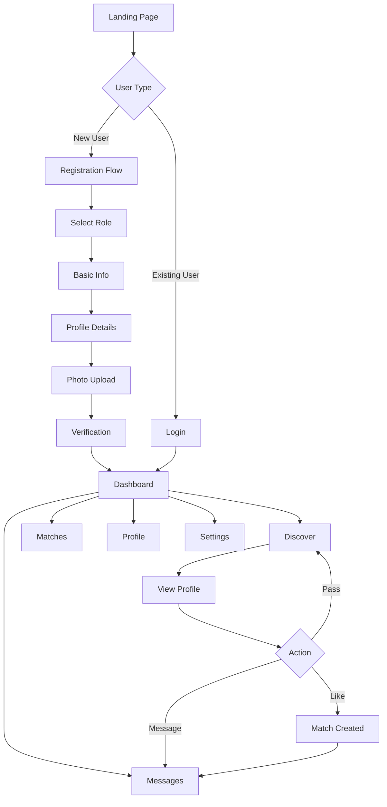
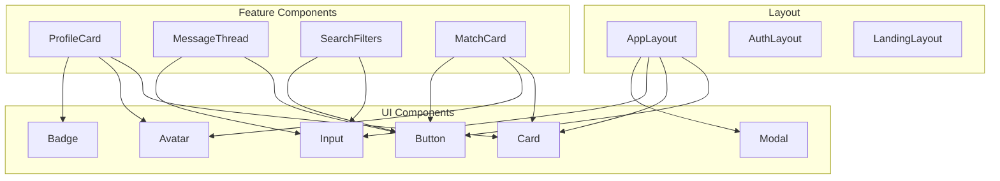

# Sugar Daddy Platform - Comprehensive Redesign Plan

## Executive Summary

This document outlines a complete redesign strategy for the Sugar Daddy Platform, transforming it from a generic dating site aesthetic into a **premium, sophisticated, and luxurious** digital experience that reflects the exclusive nature of the platform and its discerning user base.

---

## 1. Current State Analysis

### 1.1 Existing Design Assessment

#### Current Color Palette
- **Primary**: Blue (#3b82f6) - Generic, corporate feel
- **Secondary**: Slate gray - Lacks warmth and sophistication
- **Accents**: Standard success/warning/error colors
- **Background**: Light gray (#f9fafb) - Flat, uninspiring

#### Current Typography
- **Font**: Inter - Clean but generic, lacks personality
- **Hierarchy**: Basic, no distinctive heading styles
- **No serif fonts** for elegance or contrast

#### Current UI Components
- Basic shadcn/ui components with minimal customization
- Standard rounded corners and shadows
- No distinctive visual identity
- Missing premium micro-interactions

### 1.2 Identified Weaknesses

| Area | Issue | Impact |
|------|-------|--------|
| **Color Palette** | Generic blue/gray scheme | Feels like a corporate SaaS, not a luxury dating platform |
| **Typography** | Single font family, no hierarchy | Lacks sophistication and visual interest |
| **Imagery** | No hero images, lifestyle photography | Missing emotional connection |
| **Animations** | Basic CSS transitions only | Feels static and dated |
| **Layout** | Standard card-based layouts | No visual distinction from competitors |
| **Branding** | Text-only logo | Lacks memorable brand identity |
| **Mobile UX** | Basic responsive design | Not optimized for mobile-first experience |
| **Missing Pages** | No profiles, search, messaging UI | Incomplete user journey |

### 1.3 Competitor Analysis (Seeking.com Reference)

Key elements from premium dating platforms:
- Dark, sophisticated color schemes
- Gold/champagne accent colors
- High-quality lifestyle photography
- Elegant serif typography for headings
- Smooth, subtle animations
- Premium membership tiers with visual distinction
- Verified badge systems
- Advanced search and filtering

---

## 2. New Design System

### 2.1 Color Palette - "Midnight Luxe"

```
Primary Palette:
├── Obsidian Black    #0D0D0D  (Primary background)
├── Charcoal          #1A1A1A  (Secondary background)
├── Graphite          #2D2D2D  (Card backgrounds)
├── Slate             #404040  (Borders, dividers)
└── Silver            #A0A0A0  (Secondary text)

Accent Palette:
├── Champagne Gold    #D4AF37  (Primary accent)
├── Rose Gold         #B76E79  (Secondary accent)
├── Platinum          #E5E4E2  (Highlights)
└── Ivory             #FFFFF0  (Primary text)

Status Colors:
├── Emerald           #10B981  (Success, verified)
├── Amber             #F59E0B  (Warning, premium)
├── Ruby              #EF4444  (Error, urgent)
└── Sapphire          #3B82F6  (Info, links)

Gradient Combinations:
├── Gold Shimmer      linear-gradient(135deg, #D4AF37 0%, #F4E4BC 50%, #D4AF37 100%)
├── Midnight Fade     linear-gradient(180deg, #0D0D0D 0%, #1A1A1A 100%)
└── Rose Glow         linear-gradient(135deg, #B76E79 0%, #D4AF37 100%)
```

### 2.2 Typography System

```
Heading Font: Playfair Display (Serif)
├── H1: 48px/56px, weight 700, letter-spacing -0.02em
├── H2: 36px/44px, weight 600, letter-spacing -0.01em
├── H3: 28px/36px, weight 600
├── H4: 24px/32px, weight 500
├── H5: 20px/28px, weight 500
└── H6: 18px/24px, weight 500

Body Font: Inter (Sans-serif)
├── Large:  18px/28px, weight 400
├── Base:   16px/24px, weight 400
├── Small:  14px/20px, weight 400
└── XSmall: 12px/16px, weight 400

Accent Font: Cormorant Garamond (Display Serif)
└── Used for: Quotes, testimonials, special callouts

Monospace: JetBrains Mono
└── Used for: Verification codes, IDs
```

### 2.3 Spacing & Layout System

```
Spacing Scale (8px base):
├── xs:  4px   (0.5)
├── sm:  8px   (1)
├── md:  16px  (2)
├── lg:  24px  (3)
├── xl:  32px  (4)
├── 2xl: 48px  (6)
├── 3xl: 64px  (8)
└── 4xl: 96px  (12)

Container Widths:
├── sm:  640px
├── md:  768px
├── lg:  1024px
├── xl:  1280px
└── 2xl: 1440px

Border Radius:
├── none: 0
├── sm:   4px
├── md:   8px
├── lg:   12px
├── xl:   16px
├── 2xl:  24px
└── full: 9999px
```

### 2.4 Shadow System

```css
/* Subtle elevation for cards */
--shadow-sm: 0 1px 2px rgba(0, 0, 0, 0.3);

/* Standard card shadow */
--shadow-md: 0 4px 6px -1px rgba(0, 0, 0, 0.4), 
             0 2px 4px -1px rgba(0, 0, 0, 0.3);

/* Elevated elements */
--shadow-lg: 0 10px 15px -3px rgba(0, 0, 0, 0.5), 
             0 4px 6px -2px rgba(0, 0, 0, 0.4);

/* Modal/overlay shadow */
--shadow-xl: 0 20px 25px -5px rgba(0, 0, 0, 0.6), 
             0 10px 10px -5px rgba(0, 0, 0, 0.5);

/* Gold glow effect */
--shadow-gold: 0 0 20px rgba(212, 175, 55, 0.3);

/* Rose glow effect */
--shadow-rose: 0 0 20px rgba(183, 110, 121, 0.3);
```

---

## 3. Component Architecture

### 3.1 New Component Library Structure

```
src/components/
├── ui/                          # Base UI primitives
│   ├── Button/
│   │   ├── Button.tsx
│   │   ├── ButtonGroup.tsx
│   │   └── IconButton.tsx
│   ├── Input/
│   │   ├── Input.tsx
│   │   ├── TextArea.tsx
│   │   ├── Select.tsx
│   │   └── SearchInput.tsx
│   ├── Card/
│   │   ├── Card.tsx
│   │   ├── ProfileCard.tsx
│   │   ├── MessageCard.tsx
│   │   └── PricingCard.tsx
│   ├── Badge/
│   │   ├── Badge.tsx
│   │   ├── VerifiedBadge.tsx
│   │   └── PremiumBadge.tsx
│   ├── Avatar/
│   │   ├── Avatar.tsx
│   │   ├── AvatarGroup.tsx
│   │   └── OnlineIndicator.tsx
│   ├── Modal/
│   │   ├── Modal.tsx
│   │   ├── ConfirmModal.tsx
│   │   └── ImageModal.tsx
│   ├── Navigation/
│   │   ├── Navbar.tsx
│   │   ├── Sidebar.tsx
│   │   ├── BottomNav.tsx
│   │   └── Breadcrumb.tsx
│   └── Feedback/
│       ├── Toast.tsx
│       ├── Skeleton.tsx
│       ├── Spinner.tsx
│       └── Progress.tsx
│
├── features/                    # Feature-specific components
│   ├── auth/
│   │   ├── LoginForm.tsx
│   │   ├── RegisterForm.tsx
│   │   ├── ForgotPasswordForm.tsx
│   │   └── SocialAuthButtons.tsx
│   ├── profile/
│   │   ├── ProfileHeader.tsx
│   │   ├── ProfileGallery.tsx
│   │   ├── ProfileStats.tsx
│   │   ├── ProfileAbout.tsx
│   │   └── ProfileVerification.tsx
│   ├── matching/
│   │   ├── MatchCard.tsx
│   │   ├── MatchGrid.tsx
│   │   ├── SwipeCard.tsx
│   │   └── CompatibilityScore.tsx
│   ├── messaging/
│   │   ├── ConversationList.tsx
│   │   ├── MessageThread.tsx
│   │   ├── MessageBubble.tsx
│   │   ├── MessageInput.tsx
│   │   └── GiftMessage.tsx
│   ├── search/
│   │   ├── SearchFilters.tsx
│   │   ├── SearchResults.tsx
│   │   ├── FilterChips.tsx
│   │   └── SavedSearches.tsx
│   └── payments/
│       ├── SubscriptionCard.tsx
│       ├── PaymentForm.tsx
│       ├── TransactionHistory.tsx
│       └── GiftPurchase.tsx
│
├── layout/                      # Layout components
│   ├── AppLayout.tsx
│   ├── AuthLayout.tsx
│   ├── LandingLayout.tsx
│   ├── Header.tsx
│   ├── Footer.tsx
│   └── Container.tsx
│
└── shared/                      # Shared/utility components
    ├── Logo.tsx
    ├── ThemeToggle.tsx
    ├── LanguageSelector.tsx
    ├── SEOHead.tsx
    └── ErrorBoundary.tsx
```

### 3.2 Button Component Variants

```typescript
// Button variants for the new design system
const buttonVariants = {
  // Primary gold button
  primary: `
    bg-gradient-to-r from-champagne-gold to-champagne-gold/90
    text-obsidian-black font-semibold
    hover:from-champagne-gold/90 hover:to-champagne-gold
    shadow-gold hover:shadow-lg
    transition-all duration-300
  `,
  
  // Secondary outlined button
  secondary: `
    bg-transparent border-2 border-champagne-gold
    text-champagne-gold font-medium
    hover:bg-champagne-gold/10
    transition-all duration-300
  `,
  
  // Ghost button for subtle actions
  ghost: `
    bg-transparent text-silver
    hover:text-ivory hover:bg-white/5
    transition-all duration-300
  `,
  
  // Premium rose gold button
  premium: `
    bg-gradient-to-r from-rose-gold to-champagne-gold
    text-obsidian-black font-semibold
    hover:shadow-rose
    transition-all duration-300
  `,
  
  // Danger/destructive button
  danger: `
    bg-ruby/20 text-ruby border border-ruby/30
    hover:bg-ruby hover:text-white
    transition-all duration-300
  `
};
```

### 3.3 Card Component Variants

```typescript
// Card variants for different contexts
const cardVariants = {
  // Standard card
  default: `
    bg-graphite border border-slate/30
    rounded-xl shadow-md
    hover:border-champagne-gold/30
    transition-all duration-300
  `,
  
  // Profile card with image
  profile: `
    bg-graphite border border-slate/30
    rounded-2xl overflow-hidden
    hover:shadow-gold hover:border-champagne-gold/50
    transition-all duration-500
  `,
  
  // Premium/featured card
  premium: `
    bg-gradient-to-br from-graphite to-charcoal
    border border-champagne-gold/30
    rounded-2xl shadow-gold
  `,
  
  // Glass morphism card
  glass: `
    bg-white/5 backdrop-blur-xl
    border border-white/10
    rounded-2xl
  `
};
```

---

## 4. Page-by-Page Redesign Specifications

### 4.1 Homepage Redesign

#### Hero Section
```
┌─────────────────────────────────────────────────────────────────┐
│  [Full-screen hero with video/image background]                 │
│                                                                 │
│  ┌─────────────────────────────────────────────────────────┐   │
│  │  LOGO (Elegant wordmark with crown icon)                │   │
│  │                                                         │   │
│  │  "Where Success Meets Beauty"                           │   │
│  │  (Playfair Display, 64px, Champagne Gold)              │   │
│  │                                                         │   │
│  │  Discover meaningful connections with                   │   │
│  │  extraordinary individuals                              │   │
│  │  (Inter, 20px, Silver)                                 │   │
│  │                                                         │   │
│  │  [Join Now - Gold CTA]  [Sign In - Outlined]           │   │
│  │                                                         │   │
│  │  ✓ 2M+ Members  ✓ Verified Profiles  ✓ Discreet       │   │
│  └─────────────────────────────────────────────────────────┘   │
│                                                                 │
│  [Scroll indicator with subtle animation]                       │
└─────────────────────────────────────────────────────────────────┘
```

#### Features Section
- Three premium feature cards with gold icons
- Subtle hover animations with gold glow
- Features: "Verified Members", "Smart Matching", "Secure & Private"

#### Social Proof Section
- Testimonials carousel with elegant typography
- Success story highlights
- Trust badges and security certifications

#### CTA Section
- Split layout with lifestyle imagery
- Compelling copy for both Sugar Daddies and Sugar Babies
- Separate registration paths

### 4.2 Login Page Redesign

```
┌─────────────────────────────────────────────────────────────────┐
│                                                                 │
│  ┌──────────────────────┐  ┌──────────────────────────────┐   │
│  │                      │  │                              │   │
│  │  [Lifestyle Image]   │  │  Welcome Back               │   │
│  │  Full height         │  │  (Playfair Display, Gold)   │   │
│  │  Gradient overlay    │  │                              │   │
│  │                      │  │  Sign in to continue your   │   │
│  │  Quote overlay:      │  │  journey                     │   │
│  │  "Life is too short  │  │                              │   │
│  │  for ordinary        │  │  ┌────────────────────────┐ │   │
│  │  connections"        │  │  │ Email                  │ │   │
│  │                      │  │  └────────────────────────┘ │   │
│  │                      │  │  ┌────────────────────────┐ │   │
│  │                      │  │  │ Password          👁   │ │   │
│  │                      │  │  └────────────────────────┘ │   │
│  │                      │  │                              │   │
│  │                      │  │  [Remember me] [Forgot?]    │   │
│  │                      │  │                              │   │
│  │                      │  │  [Sign In - Gold Button]    │   │
│  │                      │  │                              │   │
│  │                      │  │  ─── or continue with ───   │   │
│  │                      │  │                              │   │
│  │                      │  │  [Google] [Apple]           │   │
│  │                      │  │                              │   │
│  │                      │  │  New here? Create account   │   │
│  │                      │  │                              │   │
│  └──────────────────────┘  └──────────────────────────────┘   │
│                                                                 │
└─────────────────────────────────────────────────────────────────┘
```

### 4.3 Registration Page Redesign

#### Multi-Step Registration Flow
```
Step 1: Account Type Selection
┌─────────────────────────────────────────────────────────────────┐
│                                                                 │
│  "I am looking for..."                                          │
│                                                                 │
│  ┌─────────────────────┐    ┌─────────────────────────────┐   │
│  │                     │    │                             │   │
│  │  [Elegant Icon]     │    │  [Elegant Icon]             │   │
│  │                     │    │                             │   │
│  │  A Sugar Baby       │    │  A Sugar Daddy/Mommy        │   │
│  │                     │    │                             │   │
│  │  Find a generous    │    │  Meet attractive,           │   │
│  │  partner who        │    │  ambitious individuals      │   │
│  │  appreciates you    │    │  who appreciate success     │   │
│  │                     │    │                             │   │
│  └─────────────────────┘    └─────────────────────────────┘   │
│                                                                 │
└─────────────────────────────────────────────────────────────────┘

Step 2: Basic Information
- Email, Username, Password
- Elegant form inputs with gold focus states

Step 3: Profile Details
- Name, Age, Location
- Profile photo upload with preview

Step 4: About You
- Bio, Interests, What you're looking for
- Lifestyle preferences

Step 5: Verification
- Email verification
- Optional: Photo verification for badge
```

### 4.4 Dashboard Redesign

```
┌─────────────────────────────────────────────────────────────────┐
│  [Sidebar]                    [Main Content Area]               │
│  ┌──────────┐                ┌────────────────────────────────┐│
│  │ LOGO     │                │ Good evening, [Name]           ││
│  │          │                │ Your profile is 85% complete   ││
│  │ Dashboard│                │                                ││
│  │ Matches  │                │ ┌──────┐ ┌──────┐ ┌──────┐    ││
│  │ Messages │                │ │Views │ │Likes │ │Msgs  │    ││
│  │ Search   │                │ │ 234  │ │ 45   │ │ 12   │    ││
│  │ Profile  │                │ └──────┘ └──────┘ └──────┘    ││
│  │ Settings │                │                                ││
│  │          │                │ [New Matches - Horizontal Scroll]│
│  │ ──────── │                │ ┌────┐ ┌────┐ ┌────┐ ┌────┐   ││
│  │          │                │ │    │ │    │ │    │ │    │   ││
│  │ Premium  │                │ │ 👤 │ │ 👤 │ │ 👤 │ │ 👤 │   ││
│  │ Upgrade  │                │ │    │ │    │ │    │ │    │   ││
│  │          │                │ └────┘ └────┘ └────┘ └────┘   ││
│  │ ──────── │                │                                ││
│  │          │                │ [Recent Activity]              ││
│  │ [Avatar] │                │ [Messages Preview]             ││
│  │ [Name]   │                │                                ││
│  │ [Logout] │                └────────────────────────────────┘│
│  └──────────┘                                                  │
└─────────────────────────────────────────────────────────────────┘
```

### 4.5 Profile Page Redesign

```
┌─────────────────────────────────────────────────────────────────┐
│                                                                 │
│  ┌─────────────────────────────────────────────────────────┐   │
│  │  [Cover Photo - Full Width with Gradient Overlay]       │   │
│  │                                                         │   │
│  │  ┌────────────┐                                        │   │
│  │  │            │  [Name], [Age]  ✓ Verified             │   │
│  │  │  [Avatar]  │  [Location] • [Occupation]             │   │
│  │  │            │                                        │   │
│  │  └────────────┘  [Message] [Gift] [Favorite]           │   │
│  │                                                         │   │
│  └─────────────────────────────────────────────────────────┘   │
│                                                                 │
│  ┌─────────────────────┐  ┌─────────────────────────────────┐ │
│  │ About Me            │  │ Photo Gallery                   │ │
│  │                     │  │ ┌────┐ ┌────┐ ┌────┐ ┌────┐    │ │
│  │ [Bio text with      │  │ │    │ │    │ │    │ │    │    │ │
│  │  elegant typography]│  │ └────┘ └────┘ └────┘ └────┘    │ │
│  │                     │  │                                 │ │
│  └─────────────────────┘  └─────────────────────────────────┘ │
│                                                                 │
│  ┌─────────────────────┐  ┌─────────────────────────────────┐ │
│  │ Looking For         │  │ Lifestyle                       │ │
│  │ [Tags/Chips]        │  │ [Income] [Net Worth] [Lifestyle]│ │
│  └─────────────────────┘  └─────────────────────────────────┘ │
│                                                                 │
└─────────────────────────────────────────────────────────────────┘
```

---

## 5. New Pages to Add

### 5.1 Required New Pages

| Page | Route | Priority | Description |
|------|-------|----------|-------------|
| **Search/Discover** | `/discover` | High | Advanced search with filters |
| **Profile View** | `/profile/[id]` | High | View other users' profiles |
| **Profile Edit** | `/profile/edit` | High | Edit own profile |
| **Messaging** | `/messages` | High | Conversation list |
| **Chat** | `/messages/[id]` | High | Individual chat thread |
| **Matches** | `/matches` | High | Match management |
| **Favorites** | `/favorites` | Medium | Saved profiles |
| **Who Viewed Me** | `/views` | Medium | Profile visitors |
| **Subscription** | `/subscription` | High | Premium plans |
| **Verification** | `/verify` | Medium | Identity verification |
| **Settings** | `/settings` | Medium | Account settings |
| **Privacy** | `/settings/privacy` | Medium | Privacy controls |
| **Notifications** | `/notifications` | Medium | Notification center |
| **Help/Support** | `/help` | Low | FAQ and support |
| **About** | `/about` | Low | About the platform |
| **Safety** | `/safety` | Low | Safety guidelines |

### 5.2 Page Specifications

#### Discover/Search Page
```typescript
interface DiscoverPageFeatures {
  filters: {
    ageRange: [number, number];
    location: string;
    distance: number;
    bodyType: string[];
    ethnicity: string[];
    income: string;
    netWorth: string;
    lifestyle: string[];
    lookingFor: string[];
    hasPhotos: boolean;
    isVerified: boolean;
    isOnline: boolean;
    lastActive: string;
  };
  viewModes: ['grid', 'list', 'swipe'];
  sorting: ['newest', 'lastActive', 'distance', 'compatibility'];
  savedSearches: boolean;
}
```

#### Messaging Page
```typescript
interface MessagingFeatures {
  conversationList: {
    unreadIndicator: boolean;
    lastMessage: string;
    timestamp: Date;
    onlineStatus: boolean;
    typing: boolean;
  };
  messageThread: {
    textMessages: boolean;
    photoMessages: boolean;
    giftMessages: boolean;
    voiceMessages: boolean;
    readReceipts: boolean;
    reactions: boolean;
  };
  features: {
    search: boolean;
    archive: boolean;
    block: boolean;
    report: boolean;
  };
}
```

---

## 6. Animation & Micro-Interaction Strategy

### 6.1 Animation Library: Framer Motion

```typescript
// Core animation variants
const fadeInUp = {
  initial: { opacity: 0, y: 20 },
  animate: { opacity: 1, y: 0 },
  exit: { opacity: 0, y: -20 },
  transition: { duration: 0.4, ease: [0.25, 0.46, 0.45, 0.94] }
};

const scaleIn = {
  initial: { opacity: 0, scale: 0.95 },
  animate: { opacity: 1, scale: 1 },
  exit: { opacity: 0, scale: 0.95 },
  transition: { duration: 0.3, ease: 'easeOut' }
};

const slideInRight = {
  initial: { opacity: 0, x: 50 },
  animate: { opacity: 1, x: 0 },
  exit: { opacity: 0, x: -50 },
  transition: { duration: 0.4, ease: 'easeOut' }
};

const staggerContainer = {
  animate: {
    transition: {
      staggerChildren: 0.1,
      delayChildren: 0.2
    }
  }
};
```

### 6.2 Micro-Interactions

| Element | Interaction | Animation |
|---------|-------------|-----------|
| **Buttons** | Hover | Scale 1.02, gold glow |
| **Buttons** | Click | Scale 0.98, ripple effect |
| **Cards** | Hover | Lift (translateY -4px), shadow increase |
| **Profile Cards** | Hover | Image zoom 1.05, overlay fade |
| **Like Button** | Click | Heart pulse, particle burst |
| **Message Send** | Click | Slide up, fade out |
| **Navigation** | Route change | Page fade transition |
| **Modals** | Open/Close | Scale + fade |
| **Notifications** | Appear | Slide in from right |
| **Loading** | Skeleton | Shimmer effect |
| **Scroll** | Parallax | Subtle background movement |

### 6.3 Page Transitions

```typescript
// Page transition wrapper
const pageTransition = {
  initial: { opacity: 0 },
  animate: { opacity: 1 },
  exit: { opacity: 0 },
  transition: { duration: 0.3 }
};

// Staggered list animation
const listAnimation = {
  container: {
    hidden: { opacity: 0 },
    show: {
      opacity: 1,
      transition: {
        staggerChildren: 0.1
      }
    }
  },
  item: {
    hidden: { opacity: 0, y: 20 },
    show: { opacity: 1, y: 0 }
  }
};
```

---

## 7. Mobile-First Responsive Design Strategy

### 7.1 Breakpoint System

```css
/* Mobile First Breakpoints */
--breakpoint-xs: 375px;   /* Small phones */
--breakpoint-sm: 640px;   /* Large phones */
--breakpoint-md: 768px;   /* Tablets */
--breakpoint-lg: 1024px;  /* Small laptops */
--breakpoint-xl: 1280px;  /* Desktops */
--breakpoint-2xl: 1536px; /* Large screens */
```

### 7.2 Mobile Navigation

```
Mobile Bottom Navigation Bar:
┌─────────────────────────────────────────────────────────────────┐
│                                                                 │
│  [Home]    [Discover]    [Messages]    [Matches]    [Profile]  │
│    🏠         🔍            💬           ❤️           👤        │
│                                                                 │
└─────────────────────────────────────────────────────────────────┘
```

### 7.3 Touch-Optimized Components

- Minimum touch target: 44x44px
- Swipe gestures for card navigation
- Pull-to-refresh on lists
- Bottom sheets for filters/actions
- Haptic feedback on interactions

### 7.4 Mobile-Specific Features

| Feature | Mobile Implementation |
|---------|----------------------|
| **Navigation** | Bottom tab bar + hamburger menu |
| **Search Filters** | Full-screen bottom sheet |
| **Profile View** | Swipeable photo gallery |
| **Messaging** | Native-like chat interface |
| **Notifications** | Push notifications |
| **Camera** | Native camera integration |

---

## 8. Implementation Roadmap

### Phase 1: Foundation (Week 1-2)
- [ ] Set up new color palette in Tailwind config
- [ ] Configure typography with Google Fonts
- [ ] Create base component variants
- [ ] Implement new layout components
- [ ] Set up Framer Motion

### Phase 2: Core Pages (Week 3-4)
- [ ] Redesign homepage with new hero
- [ ] Redesign login/register pages
- [ ] Redesign dashboard
- [ ] Create profile view page
- [ ] Create profile edit page

### Phase 3: Feature Pages (Week 5-6)
- [ ] Build discover/search page
- [ ] Build messaging system
- [ ] Build matches page
- [ ] Build settings pages
- [ ] Build subscription page

### Phase 4: Polish (Week 7-8)
- [ ] Add all micro-interactions
- [ ] Implement page transitions
- [ ] Mobile optimization
- [ ] Performance optimization
- [ ] Accessibility audit
- [ ] Cross-browser testing

---

## 9. Technical Implementation Notes

### 9.1 Tailwind Configuration Updates

```javascript
// tailwind.config.js additions
module.exports = {
  theme: {
    extend: {
      colors: {
        obsidian: '#0D0D0D',
        charcoal: '#1A1A1A',
        graphite: '#2D2D2D',
        slate: '#404040',
        silver: '#A0A0A0',
        ivory: '#FFFFF0',
        champagne: {
          DEFAULT: '#D4AF37',
          light: '#F4E4BC',
          dark: '#B8960F'
        },
        rose: {
          gold: '#B76E79'
        },
        platinum: '#E5E4E2'
      },
      fontFamily: {
        display: ['Playfair Display', 'serif'],
        body: ['Inter', 'sans-serif'],
        accent: ['Cormorant Garamond', 'serif']
      },
      backgroundImage: {
        'gold-shimmer': 'linear-gradient(135deg, #D4AF37 0%, #F4E4BC 50%, #D4AF37 100%)',
        'midnight-fade': 'linear-gradient(180deg, #0D0D0D 0%, #1A1A1A 100%)',
        'rose-glow': 'linear-gradient(135deg, #B76E79 0%, #D4AF37 100%)'
      }
    }
  }
};
```

### 9.2 Required Dependencies

```json
{
  "dependencies": {
    "framer-motion": "^10.x",
    "@radix-ui/react-dialog": "^1.x",
    "@radix-ui/react-dropdown-menu": "^2.x",
    "@radix-ui/react-tabs": "^1.x",
    "@radix-ui/react-tooltip": "^1.x",
    "@radix-ui/react-slider": "^1.x",
    "class-variance-authority": "^0.7.x",
    "clsx": "^2.x",
    "tailwind-merge": "^2.x",
    "lucide-react": "^0.x",
    "react-hot-toast": "^2.x",
    "swiper": "^11.x"
  }
}
```

### 9.3 Font Loading Strategy

```typescript
// app/layout.tsx
import { Playfair_Display, Inter, Cormorant_Garamond } from 'next/font/google';

const playfair = Playfair_Display({
  subsets: ['latin'],
  variable: '--font-display',
  display: 'swap'
});

const inter = Inter({
  subsets: ['latin'],
  variable: '--font-body',
  display: 'swap'
});

const cormorant = Cormorant_Garamond({
  subsets: ['latin'],
  variable: '--font-accent',
  weight: ['400', '500', '600'],
  display: 'swap'
});
```

---

## 10. Design System Documentation

### 10.1 Component Usage Guidelines

#### Buttons
- **Primary (Gold)**: Main CTAs, form submissions
- **Secondary (Outlined)**: Secondary actions, cancel buttons
- **Ghost**: Tertiary actions, navigation links
- **Premium (Rose Gold)**: Premium features, upgrades
- **Danger**: Destructive actions, delete, block

#### Cards
- **Default**: Standard content containers
- **Profile**: User profile displays
- **Premium**: Featured/highlighted content
- **Glass**: Overlay content, modals

#### Typography
- **Display (Playfair)**: Headlines, hero text, page titles
- **Body (Inter)**: All body text, UI elements
- **Accent (Cormorant)**: Quotes, testimonials, special callouts

### 10.2 Accessibility Requirements

- WCAG 2.1 AA compliance
- Color contrast ratio: minimum 4.5:1 for text
- Focus indicators on all interactive elements
- Screen reader support
- Keyboard navigation
- Reduced motion support

---

## 11. Success Metrics

### Design Goals
- [ ] Premium, luxurious aesthetic achieved
- [ ] Consistent design language across all pages
- [ ] Mobile-first responsive design
- [ ] Smooth animations and transitions
- [ ] Accessibility compliance

### Technical Goals
- [ ] Lighthouse performance score > 90
- [ ] First Contentful Paint < 1.5s
- [ ] Time to Interactive < 3s
- [ ] Cumulative Layout Shift < 0.1
- [ ] No accessibility violations

---

## Appendix A: Mermaid Diagrams

### User Flow Diagram



### Component Architecture



---

*Document Version: 1.0*
*Last Updated: December 2024*
*Author: Architecture Team*
