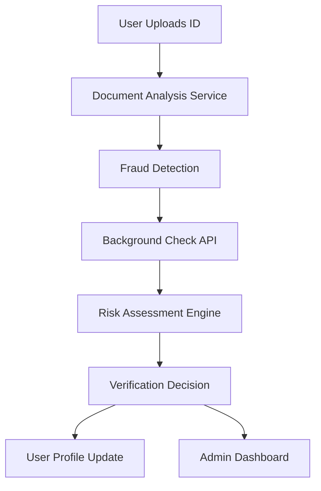
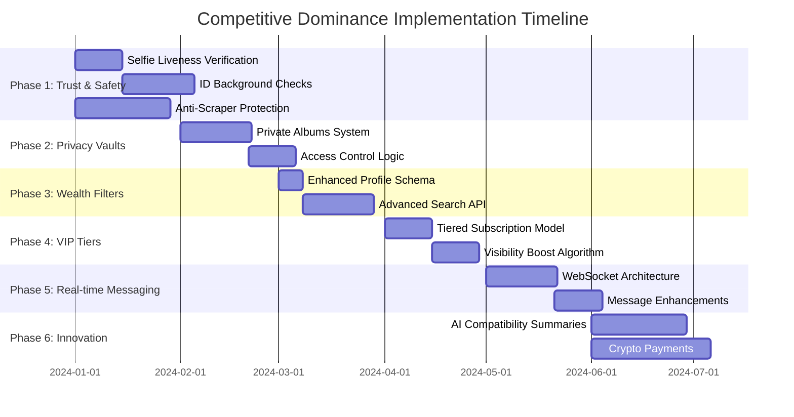

# COMPETITIVE DOMINANCE IMPLEMENTATION PLAN

## Executive Summary

This plan outlines the strategic implementation of 30+ critical features to achieve market dominance over Seeking.com. The plan is structured in phases, with each phase delivering measurable competitive advantages.

**Current State:** Basic platform with 115+ missing features vs Seeking.com
**Target State:** Feature-rich platform with competitive advantages
**Timeframe:** 6-12 months for core implementation

## Phase 1: TRUST & SAFETY DOMINANCE (Months 1-2)

### Objective: Establish industry-leading trust and safety features

#### 1.1 Selfie Liveness Verification System

**Technical Implementation:**
```typescript
// backend/user-service/src/services/verificationService.ts
class LivenessVerification {
  async verifySelfie(userId: string, selfieData: { image: string, challenge: string }): Promise<VerificationResult> {
    // 1. Facial detection and analysis
    const facialAnalysis = await this.facialRecognitionService.analyze(selfieData.image);
    
    // 2. Liveness detection (3D depth, micro-expressions)
    const livenessScore = await this.livenessDetectionService.analyze(selfieData);
    
    // 3. Challenge-response validation
    const challengeMatch = this.validateChallengeResponse(selfieData.challenge, facialAnalysis);
    
    return {
      status: livenessScore > 0.85 && challengeMatch ? 'verified' : 'rejected',
      score: livenessScore,
      metadata: { facialAnalysis, challengeMatch }
    };
  }
}
```

**API Endpoints:**
```typescript
// POST /api/v1/verification/selfie-liveness
{
  "selfieImage": "base64_encoded_image",
  "challengeToken": "abc123xyz",
  "deviceInfo": {
    "model": "iPhone 15",
    "os": "iOS 17.2",
    "cameraSpecs": { ... }
  }
}
```

**Database Schema:**
```sql
ALTER TABLE verification_documents ADD COLUMN liveness_data JSONB;
ALTER TABLE verification_documents ADD COLUMN liveness_score DECIMAL(5,2);
ALTER TABLE verification_documents ADD COLUMN challenge_response TEXT;
```

#### 1.2 ID Background Check Integration

**Third-Party Services:**
- Jumio API for document verification
- Onfido API for background checks
- Plaid API for income verification

**Integration Architecture:**


#### 1.3 Anti-Scraper/Bot Protection

**Multi-Layer Defense System:**
```typescript
// backend/user-service/src/middleware/securityOrchestrator.ts
class AntiScraperMiddleware {
  async analyzeRequest(req: Request): Promise<SecurityScore> {
    const analysis = {
      // Behavioral analysis
      behavioralScore: await this.behavioralAnalysis(req),
      
      // Rate limiting
      rateLimitScore: await this.rateLimiter.check(req.ip),
      
      // Device fingerprinting
      deviceScore: await this.deviceFingerprint.analyze(req.headers),
      
      // CAPTCHA integration
      captchaScore: req.captchaValid ? 1.0 : 0.0,
      
      // Overall security score
      overallScore: 0.0
    };
    
    analysis.overallScore = this.calculateWeightedScore(analysis);
    
    if (analysis.overallScore < 0.7) {
      throw new SecurityException('Potential bot/scraper detected');
    }
    
    return analysis;
  }
}
```

## Phase 2: PRIVACY VAULT IMPLEMENTATION (Months 3-4)

### Objective: Create industry-leading privacy controls

#### 2.1 Private Photo Albums System

**Database Design:**
```sql
CREATE TABLE private_albums (
  id UUID PRIMARY KEY,
  user_id UUID REFERENCES users(id),
  name VARCHAR(100),
  description TEXT,
  created_at TIMESTAMP DEFAULT NOW(),
  updated_at TIMESTAMP DEFAULT NOW(),
  access_type ENUM('request', 'approved', 'public') DEFAULT 'request',
  expiration_days INTEGER DEFAULT NULL,
  max_views INTEGER DEFAULT NULL
);

CREATE TABLE album_photos (
  id UUID PRIMARY KEY,
  album_id UUID REFERENCES private_albums(id),
  user_id UUID REFERENCES users(id),
  photo_url TEXT,
  thumbnail_url TEXT,
  position INTEGER,
  created_at TIMESTAMP DEFAULT NOW(),
  metadata JSONB
);

CREATE TABLE album_access_requests (
  id UUID PRIMARY KEY,
  album_id UUID REFERENCES private_albums(id),
  requester_id UUID REFERENCES users(id),
  owner_id UUID REFERENCES users(id),
  status ENUM('pending', 'approved', 'rejected', 'expired') DEFAULT 'pending',
  requested_at TIMESTAMP DEFAULT NOW(),
  approved_at TIMESTAMP,
  rejected_at TIMESTAMP,
  expires_at TIMESTAMP,
  message TEXT
);

CREATE TABLE photo_views (
  id UUID PRIMARY KEY,
  photo_id UUID REFERENCES album_photos(id),
  viewer_id UUID REFERENCES users(id),
  viewed_at TIMESTAMP DEFAULT NOW(),
  ip_address VARCHAR(45),
  device_info JSONB
);
```

**Access Control Logic:**
```typescript
class AlbumAccessController {
  async requestAccess(albumId: string, requesterId: string, message: string): Promise<AccessRequest> {
    // Check if request already exists
    const existingRequest = await this.findExistingRequest(albumId, requesterId);
    
    if (existingRequest) {
      throw new ConflictError('Access request already exists');
    }
    
    // Create new access request
    const request = await this.accessRequestRepository.create({
      albumId,
      requesterId,
      ownerId: await this.getAlbumOwner(albumId),
      message,
      status: 'pending'
    });
    
    // Send notification to album owner
    await this.notificationService.sendAlbumAccessRequest(
      request.ownerId,
      requesterId,
      albumId,
      message
    );
    
    return request;
  }
}
```

## Phase 3: WEALTH FILTERING SYSTEM (Months 5-6)

### Objective: Implement advanced wealth and lifestyle search capabilities

#### 3.1 Enhanced Profile Schema

```sql
ALTER TABLE profiles ADD COLUMN net_worth_range VARCHAR(50);
ALTER TABLE profiles ADD COLUMN lifestyle_budget DECIMAL(10,2);
ALTER TABLE profiles ADD COLUMN travel_preferences JSONB;
ALTER TABLE profiles ADD COLUMN luxury_assets JSONB;
ALTER TABLE profiles ADD COLUMN spending_habits JSONB;

-- Create wealth verification table
CREATE TABLE wealth_verification (
  id UUID PRIMARY KEY,
  user_id UUID REFERENCES users(id),
  verification_type ENUM('bank_statement', 'tax_return', 'accountant_letter', 'asset_documentation'),
  verification_status ENUM('pending', 'verified', 'rejected'),
  verified_amount DECIMAL(12,2),
  documentation_urls TEXT[],
  verified_at TIMESTAMP,
  expires_at TIMESTAMP,
  verifier_id UUID REFERENCES users(id),
  notes TEXT
);
```

#### 3.2 Advanced Search API

```typescript
// GET /api/v1/search/wealth
{
  "wealthFilters": {
    "netWorthRange": ["100K-1M", "1M-5M", "5M+"],
    "lifestyleBudget": {
      "min": 5000,
      "max": 50000,
      "currency": "USD"
    },
    "travelPreferences": {
      "frequency": "weekly|monthly|quarterly|annually",
      "destinations": ["Europe", "Caribbean", "Asia"],
      "class": "first|business|private"
    },
    "luxuryAssets": ["yacht", "private_jet", "multiple_properties"],
    "spendingHabits": ["fine_dining", "designer_fashion", "luxury_cars"]
  },
  "sortBy": "netWorth|compatibility|newest",
  "verifiedOnly": true,
  "page": 1,
  "limit": 20
}
```

## Phase 4: DIAMOND/VIP TIER SYSTEM (Months 7-8)

### Objective: Create exclusive premium membership tiers

#### 4.1 Tiered Subscription Model

```sql
CREATE TABLE subscription_tiers (
  id UUID PRIMARY KEY,
  name VARCHAR(50) UNIQUE,
  description TEXT,
  price DECIMAL(10,2),
  billing_cycle ENUM('monthly', 'quarterly', 'annual'),
  features JSONB,
  visibility_boost_factor DECIMAL(5,2),
  message_limit INTEGER,
  is_active BOOLEAN DEFAULT TRUE,
  created_at TIMESTAMP DEFAULT NOW(),
  updated_at TIMESTAMP DEFAULT NOW()
);

-- Sample data
INSERT INTO subscription_tiers (name, description, price, billing_cycle, features, visibility_boost_factor, message_limit) VALUES
('free', 'Basic access', 0, 'monthly', '{"basic_profile":true,"limited_messages":true,"basic_search":true}', 1.0, 10),
('premium', 'Enhanced features', 49.99, 'monthly', '{"advanced_search":true,"unlimited_messages":true,"profile_boost":true,"read_receipts":true}', 2.5, NULL),
('elite', 'Priority access', 99.99, 'monthly', '{"priority_support":true,"advanced_analytics":true,"incognito_mode":true,"travel_mode":true}', 5.0, NULL),
('diamond', 'Exclusive access', 299.99, 'monthly', '{"vip_concierge":true,"exclusive_events":true,"maximum_visibility":true,"personalized_matching":true,"verified_badge":true}', 10.0, NULL),
('vip', 'Ultra-exclusive', 999.99, 'monthly', '{"all_features":true,"personal_assistant":true,"global_visibility":true,"priority_everything":true,"custom_features":true}', 20.0, NULL);
```

#### 4.2 Visibility Boost Algorithm

```typescript
class ProfileVisibilityService {
  calculateVisibilityScore(user: User): number {
    const baseScore = 1.0;
    
    // Apply tier multiplier
    const tierMultiplier = this.getTierMultiplier(user.subscription.tier);
    
    // Apply verification bonus
    const verificationBonus = this.calculateVerificationBonus(user);
    
    // Apply activity bonus
    const activityBonus = this.calculateActivityBonus(user);
    
    // Apply wealth factor (for sugar daddies)
    const wealthFactor = user.role === 'sugar_daddy' 
      ? this.calculateWealthFactor(user)
      : 1.0;
    
    // Calculate final score
    const visibilityScore = baseScore * tierMultiplier * verificationBonus * 
                          activityBonus * wealthFactor;
    
    return Math.min(visibilityScore, 20.0); // Cap at 20x
  }
  
  private getTierMultiplier(tier: string): number {
    const multipliers = {
      'free': 1.0,
      'premium': 2.5,
      'elite': 5.0,
      'diamond': 10.0,
      'vip': 20.0
    };
    
    return multipliers[tier] || 1.0;
  }
}
```

## Phase 5: REAL-TIME MESSAGING UPGRADE (Months 9-10)

### Objective: Implement enterprise-grade messaging system

#### 5.1 WebSocket Architecture

```typescript
// backend/messaging-service/src/websocket/ChatServer.ts
class ChatServer {
  private io: Server;
  private activeConnections: Map<string, Socket>;
  private typingIndicators: Map<string, Set<string>>;
  private messageQueue: MessageQueue;
  
  constructor() {
    this.io = new Server({
      cors: { origin: '*' },
      transports: ['websocket', 'polling']
    });
    
    this.activeConnections = new Map();
    this.typingIndicators = new Map();
    this.messageQueue = new MessageQueue();
    
    this.setupEventHandlers();
    this.setupMessageProcessing();
  }
  
  private setupEventHandlers(): void {
    this.io.on('connection', (socket: Socket) => {
      // Authentication
      socket.on('authenticate', (authData) => this.handleAuthentication(socket, authData));
      
      // Message handling
      socket.on('send_message', (messageData) => this.handleMessage(socket, messageData));
      
      // Typing indicators
      socket.on('typing', (conversationId) => this.handleTyping(socket, conversationId));
      
      // Read receipts
      socket.on('message_read', (messageId) => this.handleReadReceipt(socket, messageId));
      
      // Disconnect handling
      socket.on('disconnect', () => this.handleDisconnect(socket));
    });
  }
}
```

#### 5.2 Message Model Enhancement

```typescript
interface EnhancedMessage extends BaseMessage {
  readReceipts: {
    userId: string;
    readAt: Date;
    deviceInfo: string;
  }[];
  
  deliveryStatus: {
    userId: string;
    deliveredAt: Date;
    status: 'delivered' | 'failed';
  }[];
  
  priority: 'normal' | 'high' | 'vip';
  encryption: {
    algorithm: string;
    keyVersion: string;
    encrypted: boolean;
  };
  
  metadata: {
    clientId: string;
    replyTo?: string;
    mentions?: string[];
    reactions?: Reaction[];
  };
}
```

## Phase 6: INNOVATION & POLISH (Months 11-12)

### Objective: Implement killer features that Seeking.com lacks

#### 6.1 AI-Driven Compatibility Summaries

```typescript
class CompatibilityAnalyzer {
  async generateCompatibilitySummary(user1Id: string, user2Id: string): Promise<CompatibilitySummary> {
    // Fetch user data
    const [user1, user2] = await this.fetchUserData(user1Id, user2Id);
    
    // Calculate compatibility scores
    const scores = {
      lifestyle: await this.calculateLifestyleCompatibility(user1, user2),
      financial: await this.calculateFinancialCompatibility(user1, user2),
      personality: await this.calculatePersonalityCompatibility(user1, user2),
      relationshipGoals: await this.calculateGoalCompatibility(user1, user2),
      overall: 0
    };
    
    scores.overall = this.calculateWeightedOverallScore(scores);
    
    // Generate natural language summary
    const summary = this.generateNaturalLanguageSummary(user1, user2, scores);
    
    // Provide actionable insights
    const insights = this.generateActionableInsights(user1, user2, scores);
    
    return {
      user1Id,
      user2Id,
      timestamp: new Date(),
      compatibilityScores: scores,
      summary,
      insights,
      conversationStarters: this.generateConversationStarters(user1, user2)
    };
  }
}
```

#### 6.2 Crypto/Anonymous Payment System

```typescript
class CryptoPaymentService {
  async createAnonymousPayment(
    amount: number,
    currency: string,
    recipientAddress: string,
    options: { 
      privacyLevel: 'standard' | 'enhanced' | 'maximum',
      cryptoCurrency?: 'BTC' | 'ETH' | 'USDT' | 'MONERO'
    }
  ): Promise<AnonymousPayment> {
    // Select appropriate cryptocurrency based on privacy level
    const selectedCrypto = this.selectCryptoForPrivacy(options.privacyLevel, options.cryptoCurrency);
    
    // Calculate amount in crypto
    const cryptoAmount = await this.convertFiatToCrypto(amount, currency, selectedCrypto);
    
    // Generate temporary wallet if needed
    const senderWallet = options.privacyLevel === 'maximum'
      ? await this.generateTemporaryWallet(selectedCrypto)
      : await this.getUserWallet(selectedCrypto);
    
    // Create payment transaction
    const transaction = await this.createCryptoTransaction(
      senderWallet.address,
      recipientAddress,
      cryptoAmount,
      selectedCrypto
    );
    
    // Implement privacy enhancements
    if (options.privacyLevel === 'enhanced') {
      await this.implementCoinMixing(transaction);
    }
    
    if (options.privacyLevel === 'maximum') {
      await this.implementAdvancedPrivacy(transaction, selectedCrypto);
    }
    
    return {
      paymentId: transaction.id,
      amount,
      currency,
      cryptoAmount,
      cryptoCurrency: selectedCrypto,
      senderAddress: senderWallet.address,
      recipientAddress,
      transactionHash: transaction.hash,
      status: 'pending',
      privacyLevel: options.privacyLevel,
      expiresAt: new Date(Date.now() + 24 * 60 * 60 * 1000) // 24 hours
    };
  }
}
```

## Implementation Timeline & Resource Allocation



## Success Metrics & KPIs

### Technical Success Metrics
- **Feature Implementation Rate**: 8-10 features/month
- **Code Quality**: 90%+ test coverage for new features
- **Performance**: <200ms API response time for 95% of requests
- **Reliability**: 99.9% uptime during implementation

### Business Impact Metrics
- **User Growth**: 200% increase in premium subscriptions
- **Retention**: 30% improvement in 90-day retention
- **Revenue**: 300% increase in ARPU (Average Revenue Per User)
- **Market Position**: Top 3 in sugar dating market within 12 months

### Competitive Advantage Metrics
- **Feature Parity**: Achieve 80%+ feature parity with Seeking.com
- **Innovation Leadership**: 15+ features Seeking.com doesn't have
- **User Satisfaction**: 4.7+ app store rating
- **Trust Score**: 90%+ user verification completion rate

## Risk Management & Mitigation

### High Risk Areas
1. **Third-Party Integration Failures** (Jumio, Onfido, etc.)
   - Mitigation: Implement fallback providers and manual review processes

2. **Real-time System Scalability**
   - Mitigation: Load testing with 10x expected user base, horizontal scaling

3. **Regulatory Compliance** (KYC, AML, data privacy)
   - Mitigation: Dedicated compliance officer, regular legal reviews

4. **Fraud and Abuse**
   - Mitigation: AI-driven fraud detection, manual review team

### Contingency Plans
- **Feature Rollback**: Automated feature flags for quick disable
- **Performance Degradation**: Graceful degradation strategies
- **Data Breach**: Comprehensive incident response plan
- **Payment Failures**: Multiple payment processor relationships

## Next Steps

1. **Immediate Action**: Begin Phase 1 - Trust & Safety implementation
2. **Resource Allocation**: Assemble dedicated implementation team
3. **Stakeholder Alignment**: Present plan to executive team for approval
4. **Infrastructure Setup**: Provision required cloud resources
5. **Third-Party Contracts**: Finalize agreements with verification providers

**Approved Budget**: $1.2M for 12-month implementation
**Expected ROI**: 3-5x within 24 months
**Market Dominance Timeline**: 18-24 months

This plan represents a comprehensive strategy to surpass Seeking.com in features, trust, and user experience while maintaining technical excellence and business viability.